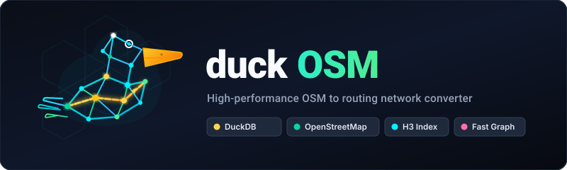

<p align="center">
  
</p>

<p align="center">
  <b>OpenStreetMap → a routable road network in one DuckDB file,<br>
  with edge IDs that survive every rebuild, clip and export.</b>
</p>

<p align="center">
  <a href="https://pypi.org/project/duckosm/"></a>
  <a href="https://github.com/Khoshkhah/duckOSM/actions/workflows/ci.yml"></a>
  
  
</p>

---

## Why duckOSM

Most OSM-to-network tools number their edges `0, 1, 2, …`. Rebuild with fresher OSM data, cut out
a smaller area, or export to a simulator, and the numbers change — so every table keyed on them
(traffic counts, speeds, map matches, demand) has to be matched to the network again.

duckOSM's `edge_id` is a **content hash** of the road segment, so it stays the same:

- **across rebuilds** — the same OSM data gives the same ids; an id only changes where that road
  was edited in OSM;
- **across clips** — a sub-area cut out of a bigger build keeps the parent's ids;
- **across exports** — SUMO, MATSim, GMNS, GeoPackage and networkx all use the `edge_id` as their
  own id.

One real segment of Högbergsgatan, Stockholm:

```text
stockholm_county.duckdb   driving.edges     edge_id = 7968481847680619937   # county build
sodermalm.duckdb          driving.edges     edge_id = 7968481847680619937   # separate Södermalm build
sodermalm (clipped)       driving.edges     edge_id = 7968481847680619937   # duckosm extract from the county
SUMO    soder.edg.xml     <edge id="7968481847680619937" from="7767910376" to="21761577" …>
MATSim  network.xml       <link id="7968481847680619937" from="7767910376" to="21761577" …>
GMNS    gmns_driving.link  link_id = 7968481847680619937
```

Attach your data to an `edge_id` once and it follows the road everywhere.

## Quick start

```bash
pip install "duckosm[routing]"          # [routing] adds networkx for route()

# a small OSM extract to try it on: Monaco, 0.7 MB, from Geofabrik
curl -LO https://download.geofabrik.de/europe/monaco-latest.osm.pbf

duckosm build --pbf monaco-latest.osm.pbf --output monaco.duckdb --modes driving
```

```python
import duckdb
from duckosm import route

con = duckdb.connect("monaco.duckdb", read_only=True)
q = "SELECT min(edge_id) FROM driving.edges WHERE name = ?"
a = con.execute(q, ["Boulevard du Larvotto"]).fetchone()[0]
b = con.execute(q, ["Avenue Princesse Grace"]).fetchone()[0]

r = route(con, a, b)                     # fastest path; weight="length" for distance
r["time_s"], r["length_m"], r["edges"]   # ~130 s, ~1.7 km, the ordered edge_ids
```

## What a build contains

`duckosm build` reads the PBF with DuckDB's multithreaded `ST_READOSM`; every stage after that is
SQL, so country-scale extracts fit in memory. Each mode gets its own schema — `driving`, `walking`,
`cycling` — with:

| Table | |
|---|---|
| `edges` | directed road segments: `edge_id`, geometry, `length_m`, `maxspeed_kmh`, `cost_s`, `lanes` (per direction), `oneway`, `highway`, `name`, H3 cells, … |
| `nodes` | junctions and end points |
| `edge_graph` | legal edge→edge turns (the line graph used for routing) |
| `turn_restrictions` | OSM turn restrictions (driving) |

Filtering is mode-aware and access-aware (drivable shared streets are kept, roads that forbid cars
are dropped), degree-2 chains of the same street are merged, and the build is validated before it
finishes. Full schema: [data dictionary](https://github.com/Khoshkhah/duckOSM/blob/main/docs/data_dictionary.md).

## Build once, clip many

Build a large region once, then cut areas out of it. No OSM is re-read, and the ids match the parent:

```bash
duckosm build --config config/sweden.yaml               # slow, once
duckosm extract --source data/db/sweden.duckdb \
    --db data/db/sodermalm.duckdb --boundary sodermalm.geojson   # seconds
```

`extract` also takes `--name "Södermalm"` or `--osm-id` when the parent has
[admin boundaries](https://github.com/Khoshkhah/duckOSM/blob/main/docs/admin_boundaries.md). A build
can also clip in one step (`source.type: duckdb` in the config, see
[pipeline](https://github.com/Khoshkhah/duckOSM/blob/main/docs/pipeline.md)).

## Exports

Each exporter reads a finished build and keeps `edge_id` as the target format's id.

| Format | Command | How it's verified |
|---|---|---|
| **SUMO** | `duckosm sumo net.duckdb` | SUMO's own `netconvert` assembles the `.net.xml`; turn restrictions become explicit connections. Needs `duckosm[sumo]` |
| **MATSim** | `duckosm matsim net.duckdb` (+ `matsim-lanes` for turn lanes and signals) | validated in the tests against MATSim's official DTD and XSD schemas |
| **GMNS** | `duckosm gmns net.duckdb` | follows the GMNS table spec (node, link, lane, movement, signal, curb) |
| **GeoPackage / shapefile** | `duckosm export-gis net.duckdb` | `duckosm gis-debug` reads the file back through GDAL (as QGIS would) and diffs every `edge_id` against the db |
| **networkx** | `duckosm export-graph net.duckdb`, or `to_networkx(con)` in Python | unit tests; GraphML or lossless gpickle |

Details and options: [`docs/`](https://github.com/Khoshkhah/duckOSM/tree/main/docs).

## Reusing the id outside duckOSM

```text
edge_id = (hash(osm_id, source, target) >> 1)::BIGINT      -- DuckDB's hash()
```

Direction is `source → target`; self-loops and parallel arcs are split with content-hashed virtual
nodes (`node_id < 0`), so the triple is unique. Three ways to use it:

```sql
SELECT edge_id_hash(osm_id, source, target) FROM my_edges;   -- macro shipped in every db
... JOIN driving.edges USING (osm_id, source, target)        -- or join on the natural key
```

```python
from duckosm import edge_id_hash
edge_id_hash(832010768, 7767910376, 21761577)   # -> 7968481847680619937
```

`hash()` is DuckDB-internal and not guaranteed across DuckDB major versions, so duckOSM pins
`duckdb<2`. For cross-project matching, pin DuckDB too or join on `(osm_id, source, target)`.

## Routing

```python
from duckosm import route, Router, to_networkx

route(con, FROM_EDGE, TO_EDGE)                  # one route: edges, time_s, length_m, path
router = Router(con); router.route(a, b)        # many routes: build the graph once
G = to_networkx(con)                            # edge-based DiGraph (nodes = edge_id)
```

## Fixing OSM errors locally

When OSM has a mistake you can't wait to be fixed upstream — a street missing `oneway`, a wrong lane
count, a missing turn restriction — add a rule to
[`osm_overrides/osm_overrides.yaml`](https://github.com/Khoshkhah/duckOSM/blob/main/osm_overrides/osm_overrides.yaml),
keyed by OSM way id:

```yaml
overrides:
  - osm_id: 4392632        # Hökens Gata, Stockholm: missing oneway
    oneway: true
```

Rules apply on every build and do nothing in areas that don't contain the way. The file ships with
the fixes we've verified for Stockholm, Vancouver and Tartu
([why each one](https://github.com/Khoshkhah/duckOSM/blob/main/osm_overrides/known_osm_issues.md)).

## Inspect

- `duckosm way net.duckdb <osm_id>` — everything the db knows about one OSM way: its tags, and the
  edges each mode cut it into.
- `duckosm viz net.duckdb` — an interactive HTML map per mode (needs `geopandas` and
  [roadstyle](https://github.com/Khoshkhah/roadstyle)).
- Every build writes a report to `reports/` (Markdown and HTML).

## Also included (experimental)

Working and tested for structure, but not yet checked in the target tools. Reports welcome.

- **OpenDRIVE** `.xodr` for CARLA / esmini / Vissim — `duckosm opendrive`
- **Lanelet2** HD-map skeleton for Autoware — `duckosm lanelet2`
- **railML 2.4** rail infrastructure — `duckosm railml`
- **Lane-level routing** — `duckosm lane-graph`, `route-lanes`
- **GMNS meso / micro networks**, an HTML viewer and a lane map — `gmns --meso --micro`, `gmns-viz`, `gmns-map`
- **Intermodal routing** (walk → drive → walk) — `duckosm multimodal`
- **Elevation** from any DEM or streamed Copernicus — `duckosm elevation` (`duckosm[elevation]`)
- **Administrative boundaries** with a parent hierarchy — `duckosm admin`
- **Base-map layers** (`features.*`, Shortbread schema) — `options.build_features: true`

## Documentation

| | |
|---|---|
| [User manual](https://github.com/Khoshkhah/duckOSM/blob/main/docs/user_manual.md) · [walkthrough](https://github.com/Khoshkhah/duckOSM/blob/main/docs/walkthrough.md) | start here |
| [Configuration](https://github.com/Khoshkhah/duckOSM/blob/main/docs/configuration.md) · [template](https://github.com/Khoshkhah/duckOSM/blob/main/config/template.yaml) | every config field |
| [Pipeline](https://github.com/Khoshkhah/duckOSM/blob/main/docs/pipeline.md) · [architecture](https://github.com/Khoshkhah/duckOSM/blob/main/docs/architecture.md) | build stages |
| [Query cookbook](https://github.com/Khoshkhah/duckOSM/blob/main/docs/query_cookbook.md) | ready-made SQL |
| [OSMnx comparison](https://github.com/Khoshkhah/duckOSM/blob/main/docs/osmnx_comparison.md) | cross-checking a build |

## License

MIT
