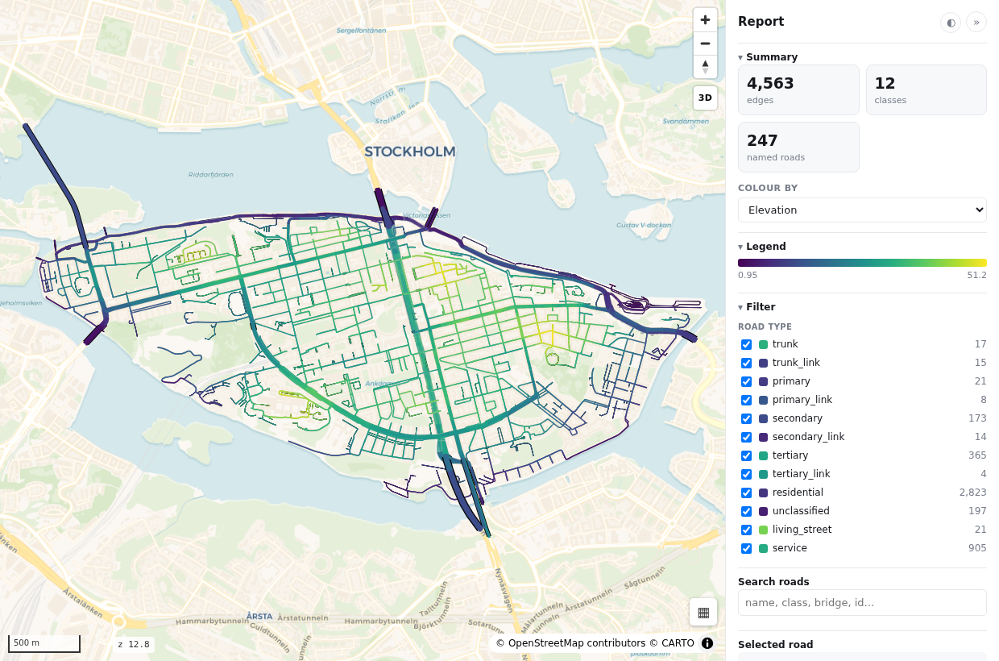
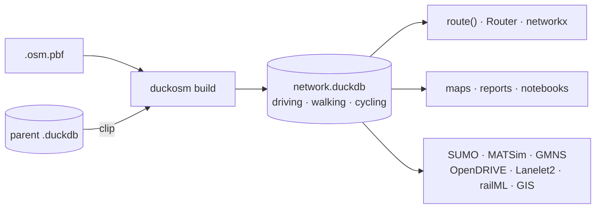
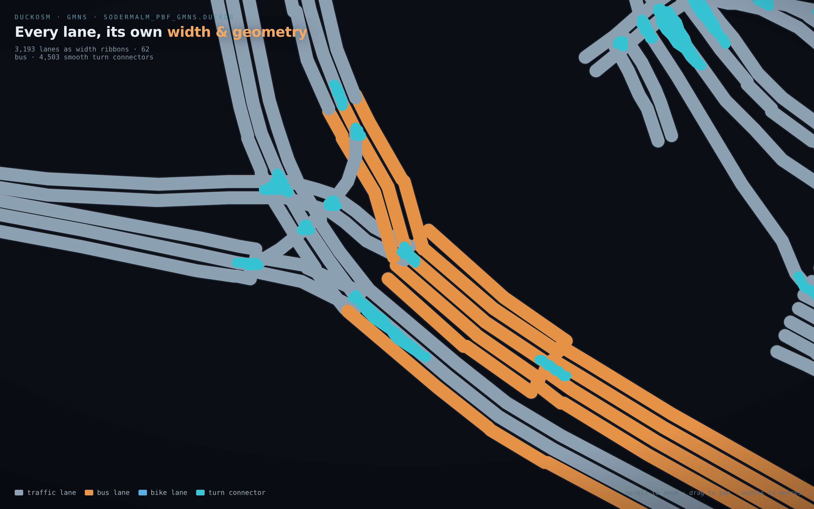

<p align="center">
  
</p>

<p align="center">
  <b>OpenStreetMap → a routable network in one portable DuckDB file.</b><br>
  built on DuckDB's fast ST_READOSM · stable edge ids · driving / walking / cycling · intermodal routing ·
  exports to SUMO, MATSim, GMNS, OpenDRIVE, Lanelet2, railML, GIS and networkx
</p>

<p align="center">
  
  
  
  
</p>

<p align="center">
  <a href="#quick-start">Quick start</a> ·
  <a href="#what-you-get">Features</a> ·
  <a href="#cli">CLI</a> ·
  <a href="#python-api">Python API</a> ·
  <a href="#exports">Exports</a> ·
  <a href="#configuration">Configuration</a> ·
  <a href="docs/">Docs</a>
</p>

<p align="center">
  
</p>

---

## Quick start

```bash
git clone https://github.com/Khoshkhah/duckOSM.git && cd duckOSM
python -m venv .venv && source .venv/bin/activate   # Windows: .venv\Scripts\activate
pip install -e ".[routing]"                         # [routing] adds networkx for route()

# a small OSM extract to try it on: Monaco, 0.7 MB, from Geofabrik
curl -LO https://download.geofabrik.de/europe/monaco-latest.osm.pbf

# PBF -> routable network (a few seconds)
duckosm build --pbf monaco-latest.osm.pbf --output monaco.duckdb --modes driving
```

```python
import duckdb
from duckosm import route

con = duckdb.connect("monaco.duckdb", read_only=True)
q = "SELECT min(edge_id) FROM driving.edges WHERE name = ?"
a = con.execute(q, ["Boulevard du Larvotto"]).fetchone()[0]
b = con.execute(q, ["Avenue Princesse Grace"]).fetchone()[0]

r = route(con, a, b)                   # fastest path; weight="length" for distance
r["time_s"], r["length_m"], r["edges"]  # ~130 s, ~1.7 km, the ordered edge_ids
```

> **Activate the venv in every new shell.** `duckosm` and its dependencies live inside `.venv`, so
> they're only on your `PATH` while it's active. Without it you'll get `command not found: duckosm` —
> fall back to `.venv/bin/duckosm ...`, `python -m duckosm ...` or `python main.py ...`.

Optional extras: `".[viz]"` (notebook maps: folium/leafmap), `".[routing]"` (networkx), `".[sumo]"`,
`".[elevation]"`, `".[tz]"`, `".[dev]"`. The `duckosm viz` map additionally needs `geopandas` +
[`roadstyle`](https://github.com/Khoshkhah/roadstyle).

## What you get

|  |  |
|---|---|
| **Fast** | the PBF is read by DuckDB's native, multithreaded `ST_READOSM`, and every stage after that is SQL |
| **Memory efficient** | streaming SQL; simplification auto-batches, so country-scale extracts fit in RAM |
| **Multi-modal** | separate `driving` / `walking` / `cycling` networks with mode-aware filtering, speeds and one-way handling (incl. cycling contraflow) |
| **Access-aware driving** | keeps drivable shared streets (`highway=pedestrian` + `motor_vehicle=yes`, reclassed `living_street`), drops drivable classes that forbid cars (`motor_vehicle=no` / `access=no`) |
| **Intermodal routing** | one layered graph (`mm.edges` + `mm.transfers`) so a trip can switch mode mid-route — walk → drive → walk. [`docs/multimodal.md`](docs/multimodal.md) |
| **Stable ids** | `edge_id` is a deterministic content hash — rebuilding from the same OSM data gives the same ids, so downstream matches survive; an id changes only where that road is edited in OSM. [↓ details](#stable-edge_id--reusing-the-hash-elsewhere) |
| **Two source modes** | build from a PBF, **or clip an area out of an existing build** (`sodermalm ← sweden`) preserving edge_ids. [`docs/pipeline.md`](docs/pipeline.md) |
| **Clean clipped areas** | in-pipeline `osmium` boundary clip + connected-component clean-up that drops boundary stubs |
| **Routing-ready** | degree-2 simplified graph, edge-adjacency line graph, turn restrictions, H3 indexing, travel-time costs, `route()` / `Router` |
| **Base-map features** | optional `features.*` schema — every OSM base-map theme mapped to the **Shortbread** vector-tile schema, extracted once into the same db so a map renderer never re-ingests OSM. [`docs/features_schema.md`](docs/features_schema.md) |
| **Exporters** | networkx · SUMO · MATSim (+lanes/signals) · GMNS (+meso/micro) · OpenDRIVE · Lanelet2 · railML · GeoPackage/shapefile — how well each is verified: [↓ Exports](#exports) |
| **Elevation** | sample any DEM (or stream a global one) into node/edge heights, in place |
| **Admin boundaries** | optional table of every OSM administrative level with a derived parent hierarchy |
| **Validation & reports** | build-time invariant checks, a `reports/<name>.{md,html}` build report, optional [roadstyle](https://github.com/Khoshkhah/roadstyle) map |
| **Portable** | a single `.duckdb` file, queryable anywhere |



<table>
  <tr>
    <td></td>
    <td></td>
  </tr>
  <tr>
    <td align="center"><code>gmns-map --style road</code> — a carriageway ribbon per direction</td>
    <td align="center"><code>gmns-map --style lane</code> — every lane at its real width</td>
  </tr>
</table>

## Documentation

| | |
|---|---|
| [`docs/user_manual.md`](docs/user_manual.md) · [`docs/walkthrough.md`](docs/walkthrough.md) | start here |
| [`docs/pipeline.md`](docs/pipeline.md) · [`docs/architecture.md`](docs/architecture.md) | build stages and internals |
| [`docs/configuration.md`](docs/configuration.md) · [`config/template.yaml`](config/template.yaml) | every config field |
| [`docs/data_dictionary.md`](docs/data_dictionary.md) · [`docs/query_cookbook.md`](docs/query_cookbook.md) | schema and ready-made SQL |
| [`docs/multi_mode.md`](docs/multi_mode.md) · [`docs/multimodal.md`](docs/multimodal.md) | per-mode networks, intermodal graph |
| [`docs/osmnx_comparison.md`](docs/osmnx_comparison.md) | cross-checking a build against OSMnx |
| [`docs/`](docs/) | exporters, lane models, boundaries, testing |

## CLI

`duckosm --help` lists the commands, `duckosm <command> --help` a command's options.

**Build & inspect**

| Command | Does |
|---|---|
| [`build`](#build) | PBF → network, or clip one from a parent db |
| [`extract`](#extract) | slice a sub-area out of a built db |
| [`admin`](#administrative-boundaries) | add OSM administrative boundaries |
| [`viz`](#viz) | roadstyle HTML map per mode |
| [`multimodal`](#multimodal) | stitch the modes into an intermodal graph |
| [`elevation`](#elevation) | sample a DEM into node / edge heights |

**Export** — all of these keep `edge_id` as the target format's id ([↓ details](#exports))

| Command | Does |
|---|---|
| `export-graph` | networkx graph → GraphML / gpickle |
| `export-gis` · `gis-debug` | GeoPackage / shapefile, and a GDAL read-back QA audit |
| `sumo` | SUMO simulation net, turn restrictions honoured |
| `matsim` · `matsim-lanes` | MATSim network, turn lanes and signals |
| `gmns` · `gmns-viz` · `gmns-map` | GMNS db (+meso / micro), interactive viewer, pretty map |
| `opendrive` · `lanelet2` · `railml` | OpenDRIVE `.xodr`, Lanelet2 HD-map, railML 2.4 |
| `lane-graph` · `route-lanes` | lane-level graph and lane-to-lane routing |

### `build`

Build a network from a PBF, or clip one from a parent db:

```bash
# From a YAML config (copy config/template.yaml and edit it first)
duckosm build --config config/my_area.yaml

# From CLI arguments
duckosm build --pbf data/maps/input.osm.pbf \
    --output data/output/network.duckdb --modes driving walking
```

With no `--config`, `build` loads `config/default.yaml` if it exists.

Build a large region once, then derive sub-areas cheaply — edge_ids are preserved, so a sub-area is
a stable view of its parent (no re-key downstream):

```bash
duckosm build --config config/sweden.yaml        # data/db/sweden.duckdb  (slow, once)
duckosm build --config config/sodermalm.yaml     # data/db/sodermalm.duckdb (fast clip)
# or ad-hoc:
duckosm build --source-db data/db/sweden.duckdb \
    --boundary data/boundaries/sodermalm.geojson \
    --output data/db/sodermalm.duckdb --modes driving
```

To cross-check a build against an independent extractor, see
[`docs/osmnx_comparison.md`](docs/osmnx_comparison.md) — how to line duckOSM's `driving` network up
with OSMnx (`drive_service` + `truncate_by_edge`), and why a naive comparison reports a ~48%
discrepancy that is entirely filter and boundary handling. Tests: `pytest tests/`.

### `extract`

Slice a sub-area out of an existing build into a new self-contained db (no re-import) — by admin
name, boundary `osm_id`, or a GeoJSON file. Edges intersecting the area are kept whole, with their
nodes / edge_graph / restrictions carried along, and edge_ids preserved:

```bash
duckosm extract --source data/db/sweden.duckdb \
    --db data/db/sodermalm.duckdb --name "Sodermalm"
# or: --osm-id 5691336   |   --boundary area.geojson
```

### `viz`

Render a roadstyle HTML map per mode into `reports/` (needs `geopandas` + `roadstyle`). Roads are
styled by class with **bridge/tunnel grade separation** (tunnels under, bridges over) on by default:

```bash
duckosm viz data/db/sodermalm.duckdb            # add --arrows for zoom-gated one-way arrows
# standalone renderer with palette choice (highsat | carto | mono — grayscale):
python scripts/roadstyle_map.py --db data/db/sodermalm.duckdb --palette mono
```

### `multimodal`

Stitch the per-mode networks of a built db into an intermodal `mm.*` graph (`mm.edges` +
`mm.transfers`) so a trip can switch mode mid-route (walk→drive→walk). Needs ≥2 modes including
`walking`; writes the `mm` schema in place. Route it with
`duckosm.route_multimodal(con, src_node, dst_node)`:

```bash
duckosm multimodal data/db/sodermalm.duckdb --transfer-cost 60    # flat transfer penalty (seconds)
# or during a build: modes: [driving, walking] + multimodal: {enabled: true} in the config
```

### `elevation`

Sample a **DEM** at every node and add ground elevation to a built db **in place**: `<mode>.nodes.ele`
and `<mode>.edges.z_from`/`z_to` (2 dp) across all modes, plus a `main.elevation_metadata` provenance
row. A **post-processing** step (not part of the build), so a plain build stays dependency-free.
Either point `--dem` at any GDAL raster, or let `--source` fetch a global DEM: `auto` (default) reads
the db's bbox and picks the best provider whose coverage contains it — **EU-DTM** (bare-earth) inside
Europe when `OPENTOPOGRAPHY_API_KEY` is set, else **Copernicus GLO-30** streamed from AWS over
`/vsicurl` (no auth, worldwide). No country-specific code — a coverage test. Once run, the z-aware
exporters emit real height (`matsim` node `z`, `opendrive` `<elevationProfile>`). Needs
`pip install duckosm[elevation]`. See [`docs/design/elevation.md`](docs/design/elevation.md):

```bash
duckosm elevation data/db/sodermalm.duckdb                        # --source auto (Copernicus, streamed)
duckosm elevation data/db/sodermalm.duckdb --dem markhojd_1m.tif  # a local high-res DTM (Lantmäteriet 1 m)
duckosm elevation data/db/sodermalm.duckdb -m driving --nodata-fill 0   # one mode; fill for DEM voids
```

## Exports

Every exporter keeps the stable `edge_id` as the target format's own id, so per-edge data (flows,
regimes, demand) maps onto the exported network **by identity — no conflation step**.

How far each export is verified:

| Export | Verified by |
|---|---|
| networkx, GeoPackage / shapefile | unit tests; `gis-debug` re-reads a GIS export through GDAL and diffs its `edge_id`s |
| SUMO | SUMO's own `netconvert` assembles and checks the network |
| MATSim (+ lanes, signals) | validated in the tests against MATSim's official DTD (network) and XSD schemas (lanes, signals) |
| GMNS | follows the GMNS table spec; not yet run through DTALite / Path4GMNS |
| OpenDRIVE, Lanelet2, railML | **best effort**: structural checks only (the official schemas aren't freely available); not yet load-tested in a simulator — please report problems |

<details>
<summary><b><code>export-graph</code> — networkx GraphML / gpickle</b></summary>

Writes a built network to a `networkx` graph file (needs `networkx`). Defaults to the geographic
node-based `MultiDiGraph` with full edge info; `-g edge` gives the edge-based routing `DiGraph`.
GraphML is portable (scalar-only — lists like `refs` and geometry are stringified, nulls dropped);
gpickle round-trips losslessly (incl. shapely objects) but is Python-only. The format is inferred
from the output extension.

```bash
duckosm export-graph data/db/sodermalm.duckdb                 # -> sodermalm_driving.graphml (node graph)
duckosm export-graph data/db/sodermalm.duckdb -o sm.gpickle   # gpickle (lossless, Python-only)
duckosm export-graph data/db/sodermalm.duckdb -g edge -o routing.graphml  # edge-based routing graph
```

```python
from duckosm import write_graph
write_graph(con, "sodermalm.graphml")                  # node graph, GraphML (format from extension)
write_graph(con, "routing.gpickle", graph="edge")      # edge-based routing graph, gpickle
```

See [networkx export](#networkx-export) for the in-memory API.

</details>

<details>
<summary><b><code>export-gis</code> / <code>gis-debug</code> — GeoPackage, shapefile, and a QA audit</b></summary>

Export the geographic network to **GeoPackage** (multi-layer, primary) or **shapefile**
(`--format shp`) for QGIS / ArcGIS / any GIS tool (`to_gis` in Python), with `edge_id` preserved as an attribute. Writes
`edges_<mode>` / `nodes_<mode>` / `boundary` layers in EPSG:4326; GeoPackage assembly needs `ogr2ogr`
(GDAL). See [`docs/gis_export.md`](docs/gis_export.md):

```bash
duckosm export-gis data/db/sodermalm.duckdb                 # -> sodermalm.gpkg (all modes + boundary)
duckosm export-gis data/db/sodermalm.duckdb -m driving      # only the driving schema
duckosm export-gis data/db/sodermalm.duckdb --format shp -o gis/   # shapefile set into gis/
```

`gis-debug` verifies an export by reading the file **back through GDAL** (the path QGIS / ArcGIS /
FME take) and writing a self-contained HTML page: a canvas map of every layer (edges by highway
class, nodes, boundary; per-mode toggles, pan/zoom, no tiles) plus a QA audit — feature counts,
geometry type, CRS, and `edge_id` integrity (a **float** dtype means a shapefile DBF rounded the
64-bit id). With `--source-db` it runs a **round-trip diff** — the exported `edge_id` set vs the db's,
per mode — and reports `PASS` / `CHECK` / `FAIL`. It verifies the file on disk, not the db. Needs
`geopandas` + `pyogrio`:

```bash
duckosm gis-debug sodermalm.gpkg --source-db data/db/sodermalm.duckdb   # -> sodermalm_gis_debug.html
duckosm gis-debug gis/ -o reports/gis_debug.html                        # a shapefile directory
```

</details>

<details>
<summary><b><code>sumo</code> — SUMO simulation network keyed on <code>edge_id</code></b></summary>

`to_sumo` writes SUMO *plain-XML* — `.nod.xml`, `.edg.xml` (ids = `edge_id`) and `.con.xml` (the
legal successors from `edge_graph`) — plus a standard netconvert config (`.netccfg`), then runs
**netconvert** to assemble the `.net.xml`. Because netconvert keeps the ids and the explicit
connections:

- **every SUMO edge id equals the duckOSM `edge_id`** — anything keyed on `edge_id` (a per-edge
  flow/demand/regime table) maps onto the SUMO network by identity, no conflation step; and
- **turn restrictions are honoured** — junction movements are limited to the `edge_graph`
  successors, not guessed from geometry.

Needs `pip install duckosm[sumo]`.

```bash
duckosm sumo data/db/sodermalm.duckdb           # -> sumo/sodermalm.{nod,edg,net}.xml
duckosm sumo data/db/sodermalm.duckdb --out-dir net --name soder --no-netconvert  # plain-XML only
```

```python
from duckosm import to_sumo
out = to_sumo(con, "sumo/")                  # sumo/network.{nod,edg,con}.xml + .netccfg + .net.xml
out["net"], out["n_edges"], out["n_connections"]

to_sumo(con, "sumo/", run_netconvert=False)  # write only the plain-XML (assemble it yourself)
to_sumo(con, "sumo/", config={"junctions.join": "true"})   # override netconvert options
to_sumo(con, "sumo/", config="my.netccfg")   # or drive netconvert with your own config file
```

Edge `shape`, `numLanes`, `speed`, `priority`/`type` and true `length` are carried over; coordinates
are geographic and netconvert projects them. netconvert options come from a built-in default
(`DEFAULT_NETCFG`, written as a standard `.netccfg`); pass `config=` (a dict merged onto the default,
or a `.netccfg` path) to change them.

</details>

<details>
<summary><b><code>matsim</code> / <code>matsim-lanes</code> — MATSim network, turn lanes and signals</b></summary>

`matsim` exports a **MATSim `network.xml`**: each edge becomes one directed `<link>` (stable
`edge_id` preserved) with `length` / `freespeed` / `capacity` / `permlanes` / `modes`, and node
coordinates reprojected to a metric CRS (default `EPSG:3006` SWEREF99 TM). The directed node+link
substrate for **MATSim / BEAM / eqasim**. See [`docs/matsim_export.md`](docs/matsim_export.md):

```bash
duckosm matsim sodermalm_pbf.duckdb                        # -> sodermalm_pbf_network.xml.gz (driving, EPSG:3006)
duckosm matsim sodermalm_pbf.duckdb --mode all             # multimodal: one network, modes=car,bike,walk per link
duckosm matsim tartu_pbf.duckdb --crs EPSG:32635 --no-gzip # UTM 35N, plain XML
```

`--mode all` (or a comma-list like `driving,cycling`) merges the per-mode networks into one, keyed on
the mode-stable `edge_id`, so a segment shared by several modes becomes a single link tagged with all
its `modes` — the form MATSim/BEAM want for multimodal agents.

`matsim-lanes` exports MATSim **turn lanes** (`lanes.xml`) and **signals**
(`signalSystems`/`signalGroups`/`signalControl.xml`) from a **GMNS db** (its `movement` table is the
lane→turn model; `link_id` = `edge_id`, so the files pair with the `matsim` network). Every file is
validated against the official MATSim v2.0 XSD schemas. See
[`docs/matsim_lanes_signals.md`](docs/matsim_lanes_signals.md):

```bash
duckosm gmns         sodermalm_pbf.duckdb -o gmns.duckdb   # movements + signalised nodes (prereq)
duckosm matsim-lanes gmns.duckdb                           # -> lanes.xml + signalSystems/Groups/Control.xml
duckosm matsim-lanes gmns.duckdb --no-signals              # lanes.xml only
```

Turn *connectivity* (legal turns) and *which* junctions are signalised are real; per-lane turn
assignment needs `turn:lanes` tags, and the signal **timing** is a default fixed-time plan (OSM has
no signal plans) — a calibrate-me placeholder.

</details>

<details>
<summary><b><code>gmns</code> / <code>gmns-viz</code> / <code>gmns-map</code> — GMNS network, lane detail, viewer & map</b></summary>

`gmns` (`to_gmns` in Python) extracts a built network to a **standalone GMNS DuckDB** (the open network standard for
DTALite / Path4GMNS / the AMS ecosystem). Writes every GMNS table OSM supports — `config`, `node`,
`link`, `geometry`, **`lane`** (per-lane rows with turns/uses/width from OSM lane tags),
**`movement`** (turns from the line graph), `use_definition`/`use_group`, `signal_controller`,
`curb_seg` — with native geometry so it renders on its own, and `link_id = edge_id`. `--to-csv` also
dumps the spec CSVs. See [`docs/gmns_export.md`](docs/gmns_export.md):

```bash
duckosm gmns data/db/sodermalm.duckdb                       # -> sodermalm_pbf_gmns.duckdb (all modes)
duckosm gmns data/db/sodermalm.duckdb -m driving --to-csv gmns/   # driving only, + spec CSVs
duckosm gmns data/db/sodermalm.duckdb --meso --micro        # + mesoscopic + microscopic (cell) networks
duckosm gmns data/db/sodermalm.duckdb --combined            # + a single mode-tagged gmns_all network
duckosm gmns data/db/sodermalm.duckdb --drive-side left     # left-hand traffic lane offset
```

Lane geometry is **drive-side aware** (two-way roads separate onto their travel sides) and turn
connectors are **smooth Béziers**, so junctions render like real roads. `--meso` adds a lane-level
mesoscopic network (section + turn-connector links); `--micro` adds a cell-based microscopic network
(lane cells + lane-change mesh + turn connectors) for microsimulation; `--combined` merges the modes
into one `gmns_all` network tagged by `allowed_uses`. See [`docs/gmns_meso.md`](docs/gmns_meso.md),
[`docs/gmns_micro.md`](docs/gmns_micro.md), [`docs/gmns_map_realism.md`](docs/gmns_map_realism.md).

`gmns-viz` writes a **self-contained interactive HTML viewer** for a GMNS DuckDB (inspection): toggle
between individual **lanes** (offset by use), the **mesoscopic** section + turn-connector network,
and the **microscopic** cell mesh; **hover any line** for its id/attributes, scroll-zoom / drag-pan.
Needs only DuckDB (geometry drawn client-side). See [`docs/gmns_viewer.md`](docs/gmns_viewer.md):

```bash
duckosm gmns-viz sodermalm_pbf_gmns.duckdb                  # -> sodermalm_pbf_gmns_viewer.html
```

`gmns-map` writes a **pretty** self-contained HTML map (presentation): `--style road` draws one
**carriageway ribbon per direction** coloured by road class (two-way roads split in two); `--style
lane` draws **every lane as a ribbon of its real width**. Both overlay smooth turn connectors, on a
dark canvas with pan/zoom. See [`docs/gmns_map.md`](docs/gmns_map.md):

```bash
duckosm gmns-map sodermalm_pbf_gmns.duckdb                  # road-by-direction (-> ..._road.html)
duckosm gmns-map sodermalm_pbf_gmns.duckdb --style lane     # every lane by width
```

<p align="center">
  
</p>

</details>

<details>
<summary><b><code>opendrive</code> — ASAM OpenDRIVE <code>.xodr</code> for AV / micro sims</b></summary>

Each edge becomes a `<road>` (stable `edge_id`) with a reprojected **reference line** (`planView`)
and **lane-level width offsets** — the continuous-geometry format that reaches AV sims (**CARLA /
esmini**) and commercial micro (**PTV Vissim / Aimsun**) that the graph exports can't. **Phase 1** is
geometry + lanes (loads/renders the real lane-level network); routable `<junction>`s (reusing the
meso turn Béziers) are the Phase-2 follow-on. See [`docs/opendrive_export.md`](docs/opendrive_export.md):

```bash
duckosm opendrive sodermalm_pbf.duckdb                     # Phase 1: roads + lanes (from the core db)
duckosm opendrive sodermalm_pbf_gmns.duckdb --junctions    # Phase 2: + routable junctions (from a GMNS db)
```

`--junctions` (Phase 2, needs a GMNS db) links roads through `<junction>` elements whose connecting
roads carry the smooth turn geometry — a *routable* network. Turn geometry & lane links are
simplified, and there's no local esmini/CARLA to prove simulator acceptance, so load-test on your side.

</details>

<details>
<summary><b><code>lanelet2</code> — Lanelet2 HD-map for Autoware</b></summary>

Each per-lane geometry from a GMNS db becomes a **lanelet** (left/right boundaries = centerline ±
½·width) with `subtype`/`one_way`/`speed_limit` tags, for **Autoware** / the `lanelet2` library.
Because Lanelet2 *is* OSM XML, the boundary ways also render natively in a deck.gl/MapLibre pipeline
(a lane-level basemap). See [`docs/lanelet2_export.md`](docs/lanelet2_export.md):

```bash
duckosm lanelet2 sodermalm_pbf_gmns.duckdb                 # -> sodermalm_pbf_gmns.lanelet2.osm
```

This is a lane-level **map skeleton in the AD standard**, not a survey-grade HD map — the geometry is
OSM centerlines offset by assumed widths (meter-level), a base layer/prior to refine, not the
finished cm-accurate map. Regulatory elements (traffic lights, stop lines) are a Phase-2 follow-on.

</details>

<details>
<summary><b><code>railml</code> — railML 2.4 rail infrastructure</b></summary>

Unlike the other exporters (which reuse the road network), this is a **new rail extraction** from the
raw OSM: `railway` ways are split at switches/junctions into **tracks** with topology (connections /
buffer stops), plus **switches**, **signals** and **OCPs** (stations) — for **OpenTrack / RailSys /
Viriato**. See [`docs/railml_export.md`](docs/railml_export.md):

```bash
duckosm railml sodermalm_pbf.duckdb                        # -> sodermalm_pbf.railml.xml (railML 2.4)
```

Infrastructure only (no timetable/rollingstock); OSM rail topology is partial and the switch model is
simplified, so treat it as a strong starting network to refine in a rail tool.

</details>

<details>
<summary><b><code>lane-graph</code> / <code>route-lanes</code> — lane-level routing</b></summary>

`lane-graph` builds a lane→lane graph in a GMNS db (turn edges from movements + lane-change edges
between adjacent lanes); `route-lanes` plans a route over it, returning the **lane sequence +
concatenated geometry + a maneuver list** ("left turn", "lane change") — not just road-to-road. It
mirrors the road `edge_graph`→`Router` pattern at lane resolution. See
[`docs/lane_routing.md`](docs/lane_routing.md):

```bash
duckosm lane-graph   sodermalm_pbf_gmns.duckdb                 # build lane_<mode>.lane_edges
duckosm route-lanes  sodermalm_pbf_gmns.duckdb <fromLane> <toLane> -o route.geojson
```

Lane connectivity *structure* is real (turns honour restrictions); lane-to-lane *turn assignment* is
permissive where `turn:lanes` is untagged — fine for lane-level planning, not lane-accurate control.

</details>

## Python API

```python
from duckosm import DuckOSM, Config

config = Config.from_args(
    pbf_path="input.osm.pbf",
    output_path="output.duckdb",
    modes=["driving"],
)
DuckOSM(config).run()
# or: DuckOSM(Config.from_yaml("config/sweden.yaml")).run()
```

### Routing (shortest path between two edges)

`edge_graph` is the edge-based routing graph (nodes = `edge_id`s; illegal turns already removed).
The `route()` / `Router` helpers wrap it with `networkx` (`pip install duckosm[routing]`):

```python
import duckdb
from duckosm import route, Router

con = duckdb.connect("data/db/sodermalm.duckdb", read_only=True)
r = route(con, FROM_EDGE, TO_EDGE)           # fastest route (default); weight="length" for distance
r["edges"]                                   # ordered edge_ids
r["time_s"], r["length_m"]                   # door-to-door totals
r["path"]                                    # per-edge name/highway/length_m/cost_s/geometry

router = Router(con)                         # many routes: build the graph once, reuse it
router.route(FROM_EDGE, TO_EDGE)
```

Defaults are fastest-by-time; pass `weight="length"` to route by distance. Every road is in the
graph, incl. `highway=service`. See
[`docs/query_cookbook.md`](docs/query_cookbook.md#shortest-path-between-two-edges).

### networkx export

`to_networkx(con)` returns the **edge-based** graph as a `networkx.DiGraph`: nodes are `edge_id`s and
arcs are legal turns (with a routing `weight`). Each node also carries its road metadata (`name`,
`highway`, `length_m`, `maxspeed_kmh`, `cost_s`, `geometry`), so you can analyse or plot the network
directly. Needs `pip install duckosm[routing]`.

```python
from duckosm import to_networkx

G = to_networkx(con)                          # DiGraph; nodes = edge_id, each with road attributes
G.nodes[edge_id]["name"], G.nodes[edge_id]["length_m"]
to_networkx(con, weight="length")             # arc weight in metres (default: travel time, cost_s)
to_networkx(con, node_attrs=False)            # bare graph (routing weight only) — faster
```

For the **geographic** (node-based) view, `to_networkx_nodes(con)` returns a `networkx.MultiDiGraph`
in the osmnx layout: nodes are OSM junction `node_id`s (each with `x`/`y` lon-lat), and every edge is
a road segment from `<mode>.edges` keyed by `edge_id`, carrying its **full attribute set** (`osm_id`,
`highway`, `name`, `oneway`, `lanes`, `length_m`, `maxspeed_kmh`, `cost_s`, `geometry`, …). Parallel
ways between the same two junctions are kept, so osmnx / momepy tooling consumes it directly.

```python
from duckosm import to_networkx_nodes

G = to_networkx_nodes(con, mode="driving")    # MultiDiGraph; nodes = junctions, edges = roads
G.nodes[node_id]["x"], G.nodes[node_id]["y"]  # lon, lat
G[u][v][edge_id]["highway"]                   # full edge attrs, keyed by edge_id
to_networkx_nodes(con, geometry="shapely")    # shapely LineStrings (needs shapely; else WKT strings)
to_networkx_nodes(con, geometry="none")       # drop geometry — lighter graph
```

Write either to a file with `write_graph` / [`duckosm export-graph`](#exports).

## Output

Each transport mode gets its own schema (`driving`, `walking`, `cycling`):

| Table | Description |
|-------|-------------|
| `edges` | Directed road segments: `edge_id` (**stable content hash**), geometry, `length_m`, `maxspeed_kmh`, `cost_s`, `lanes` (int, per-direction), `oneway` (bool), `highway`, H3 cells, … |
| `nodes` | Junction / endpoint nodes |
| `edge_graph` | Edge adjacency (line graph) for routing — built from **all** edges, incl. `highway=service` |
| `turn_restrictions` | Turn-restriction relations (driving) |

Shared tables: `raw.*` (parsed OSM), `main.visualization_metadata`, and the optional
`main.admin_boundaries`. Full column definitions:
[`docs/data_dictionary.md`](docs/data_dictionary.md); pipeline stages:
[`docs/architecture.md`](docs/architecture.md).

## Stable `edge_id` — reusing the hash elsewhere

`edge_id = (hash(osm_id, source, target) >> 1)::BIGINT` (DuckDB's `hash`). It is deterministic —
rebuilding from the same OSM data gives every edge the same id — so other projects can recompute or
match it. An id changes only when its OSM way or that way's junction nodes change. Direction is
encoded by `source → target`: the two directions of a two-way road have swapped endpoints, and
self-loops and antiparallel pairs are split with virtual nodes, so the triple is unique. Three ways
to reuse it:

**1. DuckDB SQL — the persisted macro** (shipped in every output db, incl. sub-area extracts):

```sql
SELECT edge_id_hash(osm_id, source, target) AS edge_id FROM my_edges;
```

**2. Python helper:**

```python
from duckosm import edge_id_hash, edge_id_expr
edge_id_hash(832010768, 7767910376, 21761577)   # -> 7968481847680619937
# bulk: embed the SQL fragment in your own query / over a dataframe `df`
import duckdb
duckdb.sql(f"SELECT *, {edge_id_expr()} AS edge_id FROM df").df()
```

**3. Just need the id? Join on the natural key** — version-proof, never touches the hash:

```sql
... JOIN driving.edges USING (osm_id, source, target)
```

Notes: argument **order matters** (`osm_id, source, target`); integer types are interchangeable
(`INTEGER`≡`BIGINT`). `hash()` is a DuckDB-internal function — reproducible only in DuckDB and **not
guaranteed identical across major DuckDB versions**, so duckOSM requires `duckdb<2`; for
cross-project id matching pin the DuckDB version or use the join (option 3).

Databases built before this scheme used `edge_id_hash_v1(osm_id, source, target, is_reverse)`. Both
macros ship in every db (and `edge_id_hash_v1` / `edge_id_expr_v1` in Python), so an old→new
crosswalk is one query.

## Configuration

Copy [`config/template.yaml`](config/template.yaml) (fully commented) and edit it. Full field
reference: [`docs/configuration.md`](docs/configuration.md).

<details>
<summary>The config schema at a glance</summary>

```yaml
name: my_import                        # output -> <output_path>/<name>.duckdb
output_path: data/db                   # a directory, or a full *.duckdb path

source:
  type: pbf                            # 'pbf' (build from OSM) | 'duckdb' (clip a built db)
  pbf_path: data/maps/input.osm.pbf    # type: pbf — local extract
  # source_db: data/db/sweden.duckdb   # type: duckdb — parent build to clip from

boundary:                              # the clip region (set at most one)
  path: null                           # GeoJSON polygon file
  # place: "Södermalm, Stockholm"      #   OR a Nominatim place name
  # bbox: [min_lon, min_lat, max_lon, max_lat]

clip:                                  # clean-up after clipping (needs a boundary)
  predicate: intersects                # 'within' | 'intersects' | 'centroid'
  keep_largest_component: true         # drop disconnected boundary stubs -> one clean network

modes:
  - driving
  # - walking
  # - cycling

options:
  h3_resolution: 8                     # 0-15
  simplify: true                       # contract degree-2 nodes
  memory_limit: null                   # e.g. "16GB" for country-scale builds
  # build_graph / h3_indexing / process_speeds / extract_restrictions /
  # calculate_costs default to true; see config/template.yaml for the rest

validation:
  enabled: true                        # fail the build on a broken invariant

report:
  enabled: true                        # reports/<name>_<ts>.{md,html}
viz:
  enabled: false                       # roadstyle map -> reports/<name>_network.html
```

The legacy flat keys (`pbf_path`, `boundary_path`, `h3_cell` at the top level) are still accepted as
`source.type: pbf` shorthand.

</details>

## Administrative boundaries

Add all OSM administrative areas (country, county, municipality, district, …) to a built database as
an `admin_boundaries` table, with a derived `parent_osm_id` for hierarchy traversal:

```bash
duckosm admin --pbf input.osm.pbf --db output.duckdb
```

Requires `ogr2ogr` (GDAL). The OSM `admin_level` meaning is country-specific — see
[`docs/admin_boundaries.md`](docs/admin_boundaries.md) for the levels, schema and example queries.

## Scripts & notebooks

- [`notebooks/explore_network.ipynb`](notebooks/explore_network.ipynb) — load and map the network,
  plus admin-boundary **name search** (find the `osm_id` of "sodermalm"), hierarchy traversal,
  children, and point-in-region lookup.
- `scripts/roadstyle_map.py --db <db> [--palette highsat|carto|mono] [--color-by <col>]` — the `viz`
  map standalone, with palette selection (incl. grayscale `mono`) and data-driven colouring.
- `scripts/elevation_report.py --db <db>` — a roadstyle **web report** of an
  [elevation](#elevation)-enriched db: roads coloured by ground elevation with a *Colour by* dropdown
  (Elevation / Class / Max speed / Lanes), base-map switcher, hover read-out and (when roadstyle's
  report sidebar is available) a gradient legend, filter and search. The title self-labels the DEM
  source from `main.elevation_metadata`. Run `duckosm elevation <db>` first.

## License

MIT
