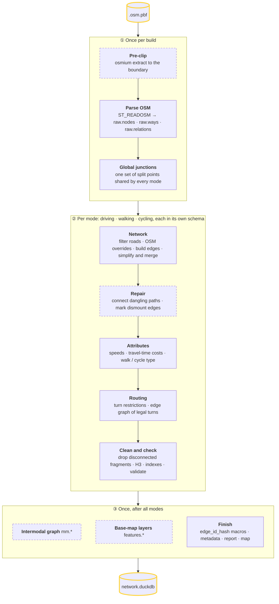
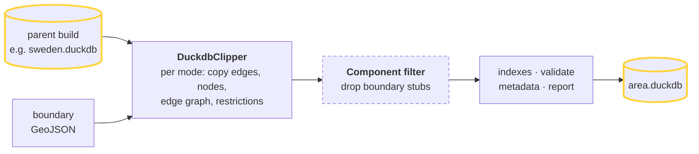

# duckOSM Architecture

## Overview

duckOSM converts OpenStreetMap PBF files to routing-ready DuckDB databases using pure SQL processing.

## Pipeline Overview

`DuckOSM(config).run()` (`src/duckosm/importer.py`) builds an ordered list of steps from the config
and runs it. There are two ways in: **build from a PBF**, or **clip from a parent build**.

### Build from a PBF

Dashed boxes only run under a condition (see the table below).



### Clip from a parent build

`source.type: duckdb` (or `duckosm extract`) never reads OSM. It copies the rows inside the
boundary out of an existing build, so every `edge_id` is the parent's.



### Every step, in order

| Stage | Step | Code | Runs when (config key, default) |
|---|---|---|---|
| ① | Pre-clip the PBF | `osmium extract` | a boundary is set; cached in `pbf/` |
| ① | Parse OSM into `raw.*` | `ST_READOSM` | always |
| ① | Boundary cells | `BoundaryCellsBuilder` | a boundary is set and `options.boundary_cells` (off) |
| ① | Global junctions | `GlobalJunctions` | `options.simplify` and `options.global_junctions` (both on) |
| ② | Filter roads | `RoadFilter` | always |
| ② | OSM overrides | `OsmOverrides` | `osm_overrides` file exists (default path `osm_overrides/osm_overrides.yaml`) |
| ② | Build edges | `GraphBuilder` | always |
| ② | Simplify and merge | `GraphSimplifier` | `options.simplify`, `options.merge_segments` (both on) |
| ② | Connect dangling paths | `PathConnector` | walking and cycling; `clip.connectivity_rescue` (on) |
| ② | Mark dismount edges | `DismountMarker` | cycling; `options.cycling_dismount` (on) |
| ② | Speeds | `SpeedProcessor` | `options.process_speeds` (on) |
| ② | Travel-time costs | `CostCalculator` | `options.calculate_costs` (on) |
| ② | Walk / cycle type | `FunctionalType` | walking and cycling; `options.functional_types` (on) |
| ② | Turn restrictions | `RestrictionProcessor` | driving only; `options.extract_restrictions` (on) |
| ② | Edge graph | `EdgeGraphBuilder` | `options.build_graph` (on) |
| ② | Component filter | `ComponentFilter` | a boundary is set and `clip.keep_largest_component` (on) or `clip.min_component_edges` > 1 |
| ② | H3 cells | `H3Indexer` | `options.h3_indexing` (on) |
| ② | Indexes | `CREATE INDEX` | always |
| ② | Validate | `Validator` | `validation.enabled` (off in code, on in the config template) |
| ③ | Intermodal graph | `MultimodalBuilder` | `multimodal.enabled` (off); needs walking plus one other mode |
| ③ | Base-map layers | `FeaturesBuilder` | `options.build_features` (off) |
| ③ | `edge_id_hash` macros | `create_edge_id_macro` | always |
| ③ | Metadata | `main.visualization_metadata` | always; time zone with `options.timezone` (off) |
| ③ | Report / map | `write_report` / `render_network` | `report.enabled` / `viz.enabled` (both off) |

The per-mode stages run once for each mode in `modes`, in its own schema (`USE driving`), which is
why the processors can use unqualified table names like `edges` and `nodes`.

---

## Step 1: Load PBF

```sql
CREATE TABLE raw.nodes AS 
  SELECT * FROM ST_READOSM('file.pbf') WHERE kind = 'node';
CREATE TABLE raw.ways AS 
  SELECT * FROM ST_READOSM('file.pbf') WHERE kind = 'way';
CREATE TABLE raw.relations AS 
  SELECT * FROM ST_READOSM('file.pbf') WHERE kind = 'relation';
```

> [!TIP]
> For more information on loading OSM data into DuckDB, see these resources:
> - [How to read OSM data with DuckDB (Medium)](https://medium.com/data-science/how-to-read-osm-data-with-duckdb-ffeb15197390)
> - [DuckDB Spatial Extension GitHub](https://github.com/duckdb/duckdb-spatial)

---

## Step 2: Filter Roads

The driving filter is **access-aware** (an *exclude* list of non-road classes, plus the OSM
access tags) rather than a fixed include list — so it keeps drivable shared streets and drops
drivable-class ways that forbid cars:

```sql
CREATE TABLE ways AS
SELECT osm_id,
       -- A rescued shared street (an excluded class that nonetheless admits cars) is
       -- reclassed to living_street so its capacity/speed reflect a slow drivable road.
       CASE WHEN tags['highway'] IN ('footway','cycleway','path','pedestrian','steps',
                                     'corridor','track', ...)
                 AND coalesce(tags['motor_vehicle'],tags['motorcar'],tags['vehicle'])
                     IN ('yes','designated','permissive','destination')
            THEN 'living_street' ELSE tags['highway'] END AS highway,
       tags['name'] AS name, refs, ...
FROM raw.ways
WHERE tags['highway'] IS NOT NULL
  -- a road class, OR motor vehicles explicitly allowed (rescues drivable pedestrian/footway):
  AND ( tags['highway'] NOT IN ('footway','cycleway','path','pedestrian','steps','corridor',
                                'bridleway','construction','proposed','raceway','bus_guideway',
                                'escape','platform','elevator','track')
        OR coalesce(tags['motor_vehicle'],tags['motorcar'],tags['vehicle'])
           IN ('yes','designated','permissive','destination') )
  -- but never where cars are forbidden / access is closed (unless a motor-vehicle tag re-permits):
  AND coalesce(tags['motor_vehicle'],'') <> 'no'
  AND coalesce(tags['motorcar'],'') <> 'no'
  AND ( coalesce(tags['access'],'') NOT IN ('no','private')
        OR coalesce(tags['motor_vehicle'],tags['motorcar'])
           IN ('yes','designated','permissive','destination') );
```

### Lane count (`lanes`)

The `lanes` column on each edge is an **integer lane count for that edge's direction of
travel**, and is never NULL. It is computed in two parts.

**1. Per-direction counts on `ways`** (in `road_filter`). The OSM tags are parsed to
integers — `regexp_extract(..., '\d+')` takes the first integer, so `"2"`, `"2;3"` and
`"1.5"` all yield a value; `0`, blanks and non-numeric values become NULL. A forward and a
backward count are then derived:

```sql
-- n_total = lanes, n_fwd = lanes:forward, n_bwd = lanes:backward (parsed ints)
-- Forward direction:
CASE
    WHEN n_fwd IS NOT NULL THEN n_fwd                      -- explicit lanes:forward wins
    WHEN oneway                                            -- one-way (boolean): all lanes forward
        THEN COALESCE(n_total, default_lanes)
    WHEN n_total IS NOT NULL AND n_bwd IS NOT NULL
        THEN GREATEST(n_total - n_bwd, 1)                  -- remainder of the total
    WHEN n_total IS NOT NULL
        THEN GREATEST(CEIL(n_total / 2.0)::INT, 1)         -- two-way split, larger half
    ELSE default_lanes                                     -- nothing tagged → fallback
END AS lanes_fwd
-- Backward direction is symmetric: lanes:backward, else (n_total - n_fwd),
-- else FLOOR(n_total / 2), else default_lanes.
```

`default_lanes` is a class-based fallback applied **only when nothing is tagged**:
**motorway / trunk → 2, every other highway class → 1.**

**2. Each edge picks its side** (in `graph_builder` / `graph_simplifier`). The forward edge
takes `lanes_fwd`; the reverse edge created for two-way roads takes `lanes_bwd` (looked up
by joining the edge back to its way on `osm_id`). One-way roads have no reverse edge, so all
lanes stay on the single forward edge.

> [!NOTE]
> OSM lane tagging is dense on major roads but sparse on local roads (in Sweden:
> motorway ~100%, trunk ~93%, residential/service <3%), so the class-based fallback is what
> keeps the column fully populated.

---

## Step 3: Build Initial Edges

```sql
CREATE TABLE edges AS
SELECT
    -- Stable, deterministic edge_id: a hash of the edge's identity. Forward = is_reverse FALSE;
    -- the reverse edge (created for two-way roads) hashes its own swapped endpoints + TRUE.
    (hash(osm_id, refs[1], refs[len(refs)], FALSE) >> 1)::BIGINT AS edge_id,
    refs[1] AS source,
    refs[len(refs)] AS target,
    osm_id,
    ST_MakeLine(coordinates) AS geometry
FROM ways;
```

### Stable edge ids

`edge_id` is **not** a row number. It is a hash of three ids that OpenStreetMap already gives the
segment:

```sql
edge_id = (hash(osm_id, source, target) >> 1)::BIGINT      -- DuckDB's hash()
```

- **`osm_id`**: the OSM way the segment comes from. A merged edge (several ways joined by
  [`merge_segments`](merging.md)) takes the `osm_id` of its first segment, at its `source` end.
- **`source`, `target`**: the OSM node ids where the segment starts and ends. Their order is the
  direction: the two directions of a two-way street swap them, so each direction has its own id.

The triple has to be unique. Where the geometry would repeat it (a self-loop with
`source = target`, a way that passes the same pair of junctions twice, the two arcs of a two-way
loop), the simplifier splits the edge at a **virtual node**: `node_id < 0`, itself a hash of the
segment's content, so it is just as stable. A build-time guard fails if a duplicate triple
survives.

Because every input is an OpenStreetMap id, an unchanged segment gets the same `edge_id` on every
rebuild, in every area clipped from the same build, and in every export. It changes only when that
way or its end nodes change in OSM. `hash()` is DuckDB-internal and not guaranteed across DuckDB
major versions, which is why duckOSM requires `duckdb<2`; to match ids from another tool, join on
`(osm_id, source, target)` instead.

---

## Step 4: Graph Simplification

### 4a. Find Junctions
```sql
CREATE TABLE junctions AS
SELECT node_id FROM node_counts
WHERE way_count > 1 OR endpoint_count > 0;
```

### 4b. Segment Ways at Junctions
```sql
-- Split ways into segments between consecutive junctions
```

### 4c. Calculate Lengths with Haversine
```sql
-- Note: ST_Length_Spheroid has precision issues for certain coordinate ranges
-- We use a manual Haversine summation over all geometry vertices instead
WITH edge_points AS (
    SELECT edge_id, idx,
        ST_X(ST_PointN(geometry, idx)) as lon,
        ST_Y(ST_PointN(geometry, idx)) as lat
    FROM point_indices
)
SELECT edge_id, SUM(
    12742000 * ASIN(SQRT(
        POWER(SIN(RADIANS(p2.lat - p1.lat) / 2), 2) +
        COS(RADIANS(p1.lat)) * COS(RADIANS(p2.lat)) *
        POWER(SIN(RADIANS(p2.lon - p1.lon) / 2), 2)
    ))
) AS length_m
FROM edge_points p1
JOIN edge_points p2 ON p1.edge_id = p2.edge_id AND p2.idx = p1.idx + 1
GROUP BY edge_id;
```

### 4d. Split Self-Loops
```sql
-- Split edge where source = target
SELECT 
    -(edge_id) AS virtual_node_id,  -- Negative ID
    ST_LineSubstring(geometry, 0, 0.5) AS first_half,
    ST_LineSubstring(geometry, 0.5, 1) AS second_half
FROM edges WHERE source = target;
```

### 4e. Add Reverse Edges (Two-Way Roads)
```sql
INSERT INTO edges
SELECT 
    e.target AS source, e.source AS target,
    w.lanes_bwd AS lanes,          -- reverse edge carries the backward lane count
    ST_Reverse(e.geometry),
    TRUE AS is_reverse
FROM edges e
JOIN ways w ON w.osm_id = e.osm_id
WHERE NOT e.oneway;          -- oneway is a boolean: FALSE = two-way
```

---

## Step 5: Process Speeds

```sql
ALTER TABLE edges ADD COLUMN maxspeed_kmh FLOAT;
UPDATE edges SET maxspeed_kmh = 
    CASE 
        WHEN maxspeed LIKE '%mph%' THEN CAST(regexp_extract(maxspeed, '\d+') AS FLOAT) * 1.60934
        WHEN maxspeed ~ '^\d+$' THEN CAST(maxspeed AS FLOAT)
        ELSE (SELECT default_speed FROM highway_defaults WHERE highway = edges.highway)
    END;

-- maxspeed_kmh is the normalized, always-populated speed; drop the raw OSM string.
ALTER TABLE edges DROP COLUMN maxspeed;
```

---

## Step 6: Calculate Costs

```sql
ALTER TABLE edges ADD COLUMN cost_s FLOAT;
UPDATE edges SET cost_s = length_m / (maxspeed_kmh / 3.6);
```

---

## Step 7: Build Edge Graph (Line Graph)

```sql
CREATE TABLE edge_graph AS
SELECT 
    e1.edge_id AS from_edge,
    e2.edge_id AS to_edge,
    e2.edge_id AS via_edge,
    e1.cost_s AS cost
FROM edges e1
JOIN edges e2 ON e1.target = e2.source
WHERE e1.edge_id != e2.edge_id;
```

---

## Step 8: H3 Indexing

```sql
ALTER TABLE edges ADD COLUMN from_cell UBIGINT;
ALTER TABLE edges ADD COLUMN to_cell UBIGINT;
UPDATE edges SET 
    from_cell = (SELECT h3_cell FROM nodes WHERE node_id = edges.source),
    to_cell = (SELECT h3_cell FROM nodes WHERE node_id = edges.target);
```

---

## Type Summary

| Column | Type | 
|--------|------|
| `edge_id` | INTEGER |
| `source/target` | BIGINT |
| `from_cell/to_cell` | UBIGINT |
| `length_m/cost_s/maxspeed_kmh` | FLOAT |
| `lanes` | INTEGER |
| `oneway` | BOOLEAN |
