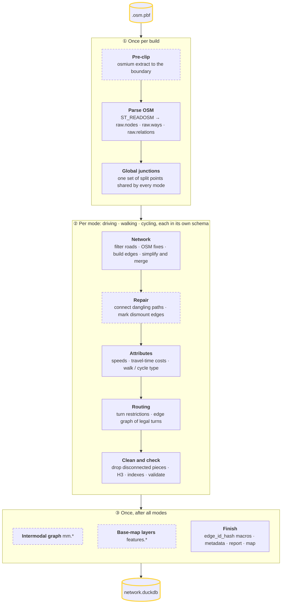
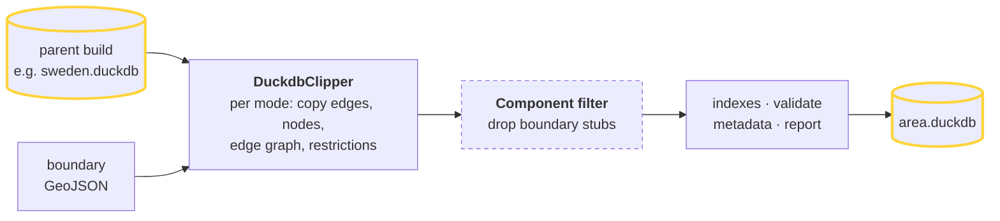

# How a build works

A build (`duckosm build`, or `DuckOSM(config).run()` in Python) runs a list of steps chosen from the
config. There are two ways in: **build from a PBF**, or **clip from a parent build**. Each step is SQL
that runs inside the output DuckDB file.

## Build from a PBF

Dashed boxes only run under a condition (see the table below).

## Clip from a parent build

`source.type: duckdb` in a config (or `duckosm build --source-db`) reads no OSM. It copies the rows
inside the boundary out of an existing build, so every `edge_id` is the parent's.
How to use it: [Several areas from one region](../guides/prepare-area.md#several-areas-from-one-region).

A clip build needs a boundary. It copies `edges`, `nodes`, `edge_graph` and `turn_restrictions`
only: no `raw.*`, `ways` or `edge_id_map`.

## Every step, in order

Config keys are shown with their default.

| Stage | Step | Runs when |
|---|---|---|
| ① | Pre-clip the PBF (`osmium extract`) | a boundary is set and `osmium` is installed (else the whole PBF is read, with a warning); the result is cached in `pbf/` |
| ① | Parse OSM into `raw.*` (`ST_READOSM`) | always |
| ① | Load the boundary into `main.boundary` | a boundary is set; `boundary.buffer_m` (0) grows it |
| ① | Boundary cells (`main.boundary_cells`) | a boundary is set and `options.boundary_cells` (off) |
| ① | Global junctions (`main.global_junctions`) | `options.simplify` and `options.global_junctions` (both on) |
| ② | Filter roads | always; the rules per mode: [What each network contains](networks.md) |
| ② | OSM fixes | a fixes file is named: `osm_overrides:` in the config, or `build --fixes`. There is no default file. See [Fix OSM errors](../guides/fix-osm-errors.md) |
| ② | Build edges | always |
| ② | Simplify and merge | `options.simplify` and `options.merge_segments` (both on) |
| ② | Connect dangling paths | walking and cycling; `clip.connectivity_rescue` (on) |
| ② | Mark dismount edges | cycling; `options.cycling_dismount` (on) |
| ② | Speeds | `options.process_speeds` (on) |
| ② | Travel-time costs | `options.calculate_costs` (on) |
| ② | Walk / cycle type | walking and cycling; `options.functional_types` (on) |
| ② | Turn restrictions | driving only; `options.extract_restrictions` (on), which needs `simplify` |
| ② | Edge graph | `options.build_graph` (on) |
| ② | Component filter | a boundary is set, `build_graph` is on, and `clip.keep_largest_component` (on) or `clip.min_component_edges` > 1 |
| ② | H3 cells | `options.h3_indexing` (on) |
| ② | Indexes | always |
| ② | Validate | `validation.enabled` (off; on in the config template). See [Check a build](../guides/check-build.md) |
| ③ | Intermodal graph `mm.*` | `multimodal.enabled` (off); needs walking plus another mode. See [Routing across modes](multimodal.md) |
| ③ | Base-map layers `features.*` | `options.build_features` (off) |
| ③ | `edge_id_hash` macros | always |
| ③ | `main.visualization_metadata` and the time zone | always; a build fails if the area's time zone can't be found |
| ③ | Report / map | `report.enabled` / `viz.enabled` (both off) |

Each mode runs in its own schema (`driving`, `walking`, `cycling`), so the same tables exist once
per mode. The steps in ② are explained in [Stable edge ids](edge-ids.md) (build, simplify, merge),
[What each network contains](networks.md) (filter, speeds, costs, types, restrictions) and
[Network clean-up](cleanup.md) (connect, component filter, validate).

## One mode, step by step

Monaco, driving (`duckosm build -c config/sample_monaco.yaml`, from the build log):

| After | Result |
|---|---|
| Filter roads | 1,135 OSM ways |
| Build edges | 1,603 edges (one per way, plus the reverse of two-way ways) |
| Simplify and merge | 2,182 edges: ways split at junctions |
| Turn restrictions | 38 restrictions mapped to edges |
| Component filter | 2,133 edges: 49 edges in 8 small pieces dropped |

## What stays in the database

Besides the routing tables (`edges`, `nodes`, `edge_graph`, `turn_restrictions`), a PBF build keeps
the parsed OSM data (`raw.*`), each mode's filtered `ways` and `way_nodes`, `virtual_nodes`,
`edge_id_map`, and `main.global_junctions`. Every table and column:
[Data dictionary](../data_dictionary.md).
