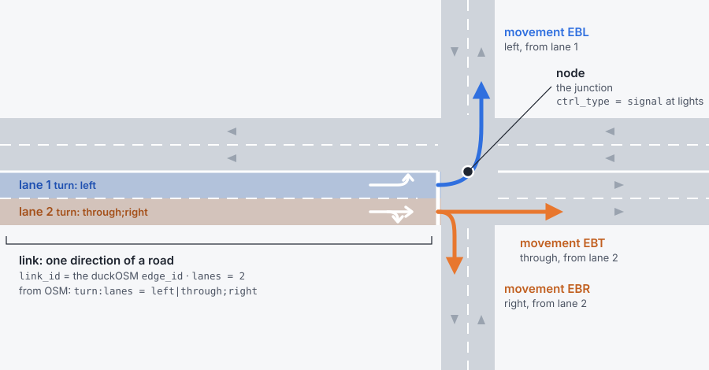

# GMNS

```bash
duckosm gmns monaco.duckdb             # -> monaco_gmns.duckdb
duckosm gmns monaco.duckdb --to-csv gmns/     # also the spec CSVs
```

[GMNS](https://zephyr-data-specs.github.io/GMNS/) (General Modeling Network Specification) is the
open table format of DTALite, Path4GMNS and other network-modelling tools. duckOSM writes every
GMNS table that OSM has data for into **one new DuckDB file** that stands alone: it doesn't need
the source database, and its tables carry real geometry, so you can query and draw them.
`--to-csv DIR` also writes the standard `node.csv`, `link.csv`, `lane.csv`, … into `DIR/<mode>/`.
The CSVs have only the columns the spec defines, so the geometries and each lane's turns stay in the
DuckDB file.



## What's in it

Every table, column by column, with where each value comes from: [GMNS tables](gmns_tables.md).

One schema per mode, `gmns_driving`, `gmns_walking`, `gmns_cycling`. Monaco, driving:

| Table | Rows | What |
|---|---|---|
| `node` | 1,719 | junctions; `ctrl_type = 'signal'` at traffic lights |
| `link` | 2,765 | directed roads (in driving also the 18 bus-only directions, one `bus` lane each: [link](gmns_tables.md#link)): **`link_id` = `edge_id`**, length, speed, lanes, capacity (a per-lane default by road class), `facility_type` (the OSM `highway`), name, and (DuckDB only) `bridge` / `tunnel` / `layer` |
| `lane` | 3,182 | one row per lane, with its turns, allowed uses and width where OSM tags them |
| `movement` | 3,500 | legal turns (from `edge_graph`; turning back along the same road only at a dead end, or where it's the only way into the road's other direction): type (left, thru, right, uturn, merge, diverge), code (`NBL`, `EBT`, …), the lanes it starts from and ends in (equal-length ranges read in order: from `turn:lanes` where tagged, else osm2gmns's rule, [design](https://github.com/Khoshkhah/duckOSM/blob/main/docs/design/gmns_lane_movements.md)), a curved turn path |
| `crossing`, `lane_crossing` | duckOSM extension | the pedestrian crossings painted on the driving lanes, and which stretch of each lane they cover (in `gmns_driving` only): from the OSM crossing ways and the crossing nodes that have no way ([design](https://github.com/Khoshkhah/duckOSM/blob/main/docs/design/gmns_crossings.md)) |
| `link_along` | duckOSM extension | one road a footpath runs along (a footpath often runs along several): its `link_id`, the road's `along_link_id` and network, the metres along it and the gap; the roads are ones cars can use, of the footpath's own level. The link also has `along_link_id` / `along_mode` / `along_gap_m` / `along_kind` for the road with the longest stretch ([columns](gmns_tables.md#link_along)) |
| `lane_connector` | duckOSM extension | one path per lane pair of a movement: a curve from the end of one lane to the start of the next (`from_lane_id`, `to_lane_id`, `mvmt_id`, `width`, `geom`); lanes stop where a junction starts or where they'd jump sideways, and the connector joins them; a U-turn at a road end is a half-circle as wide as its lanes; with driving and walking exported, `gmns_walking.lane_connector` also holds a footway's join to a road lane at a shared node ([design](https://github.com/Khoshkhah/duckOSM/blob/main/docs/design/gmns_lane_connectors.md)) A road's pieces are placed as one run, so a lane going on through a junction or a bend is one continuous line ([design](https://github.com/Khoshkhah/duckOSM/blob/main/docs/design/gmns_lane_runs.md)). |
| `geometry` | 2,765 | link shapes |
| `signal_controller` | 1 | where the traffic lights are (OSM has no timings) |
| `curb_seg` | 2 | on-street parking, where OSM tags `parking:*` |
| `location` | 1,803 | OSM points on a link: crossings, give-way and stop signs, signals, parking entrances |
| `zone` | 1 | the area: every node is in it; its outline when the database was built with a boundary |
| `config`, `use_definition`, `use_group` | | units (metres, km/h), CRS (EPSG:4326), modes |

Tables GMNS defines but OSM has no data for (signal timing, time-of-day) are left out, as the spec
intends: see [GMNS tables](gmns_tables.md#what-is-not-written-and-why).

## Lanes from OSM tags

Every link gets its lanes from its lane count; where OSM has the details, they're filled in:

| OSM tag | Gives |
|---|---|
| `lanes`, `lanes:forward`, `lanes:backward` | the number of lanes each way |
| `turn:lanes` | each lane's turns, and which lanes feed each movement |
| `width:lanes` | lane width (empty where untagged) |
| `bicycle:lanes`, `psv:lanes` | bike and bus lanes |

Most ways have none of these (Monaco: `turn:lanes` on 0.4 % of roads), so most lanes are general
lanes with no width. Lane details need the raw OSM tags, which a PBF build keeps; an area clipped
from a bigger build (`source.type: duckdb`, `duckosm extract`) gets lane counts only. Each lane also
has a centre line drawn beside the road, on the traffic side, 3.25 m apart (`--drive-side left` for
left-hand traffic). A road mapped as two one-way ways, one per direction, drawn closer together
than its lanes need, is placed as one road: each direction's lanes start from the line midway
between the two ways, so the directions never overlap (`--no-pair-carriageways` turns this off;
[design](https://github.com/Khoshkhah/duckOSM/blob/main/docs/design/gmns_paired_carriageways.md)).

In the walking network a footpath (`footway`, `path`, `steps`, …) is one 2 m strip for both of its directions, centred on
its line (people walk both ways on it). A **sidewalk** (`footway=sidewalk`) is placed from the cross-section of the road it runs
along, not from its own OSM line: its lane lies just outside the road's kerb-side lane (the road's lanes from
`gmns_driving` where it is there), so it never lies on the carriageway (`--no-walk-frame` turns this off,
`--walk-clearance M` leaves a gap to the kerb; only a mapped sidewalk moves, no footpath is put where OSM has none; a sidewalk that still lies on a road (its road on its far side, too far, or none found) is pushed out across the road to the nearer kerb, half its width beyond it, so a street does not lose a side;
[design](https://github.com/Khoshkhah/duckOSM/blob/main/docs/design/gmns_walking_frame.md)).

## Meso and micro networks

For simulators that work below the road level:

```bash
duckosm gmns monaco.duckdb --meso --micro
```

- **Meso** (`meso_driving`): each road becomes a section, and each legal turn a connector
  between sections. Monaco: 2,765 sections + 3,500 connectors.
- **Micro** (`micro_driving`): each lane cut into 7 m cells, with lane-change links between side-by-side
  cells and turn links across junctions. Monaco: 25,423 links.

Both are modelled on osm2gmns' (not identical: see [GMNS tables](gmns_tables.md#meso-and-micro-networks)); their ids are built from `edge_id` (`M<edge_id>` for a section,
`X<from edge_id>-<to edge_id>` for a meso connector), so they stay the same across rebuilds and lead back to the road.
Driving by default; `--meso-mode cycling` / `--micro-mode cycling` for cycling.

## All modes in one network

`--combined` adds `gmns_all`: one `link` table for every mode, a road shared by several modes
being one link with `allowed_uses = 'auto,bike,walk'`. Monaco: 12,789 links.

## See it

```bash
duckosm gmns-viz monaco_gmns.duckdb                 # inspect: lanes (+ meso / micro if built), hover for ids
duckosm gmns-map monaco_gmns.duckdb                 # present: every lane at its width, on a base map
```

Each writes one HTML file. `-m` picks the mode. `gmns-map` draws with
[lanestyle](https://github.com/Khoshkhah/lanestyle) (`pip install "duckosm[viz]"`).

Monaco's lanes, as `gmns-map` draws them (scroll to zoom, drag to move): each lane is a strip of
road with its lane lines and an arrow for its direction, and bridges and tunnels keep their order.
**Click a lane**: it turns red, and the lanes its movements lead into turn green. Bus and bike lanes
get their own colour.

<iframe src="../../maps/monaco_gmns_lanes.html" title="Monaco's lanes, drawn by duckosm gmns-map"
        loading="lazy" style="width: 100%; height: 560px; border: 0; border-radius: 8px"></iframe>

## Options

| Option | Does | Default |
|---|---|---|
| `-m`, `--mode` | modes to export; repeat for several | every mode in the db |
| `-o`, `--out` | output file | `<name>_gmns.duckdb` |
| `--to-csv DIR` | also write the spec CSVs | |
| `--meso`, `--micro` | also build the meso / micro networks | off |
| `--meso-mode`, `--micro-mode` | their modes | `driving` |
| `--combined` | also write `gmns_all` | off |
| `--drive-side` | `right` or `left` traffic | `right` |
| `--no-pair-carriageways` | centre each one-way way's lanes on it, even beside its opposite direction | paired |
| `--walk-frame` | move a mapped sidewalk off the carriageway (placed from its road's kerb, or pushed to the nearer kerb) and join the footways that meet it | off: footways stay as OSM maps them |
| `--walk-clearance` | gap in metres between the kerb and a footpath placed from its road | 0 |
| `--no-lane-geometry` | skip the lane centre lines | computed |
| `--gtfs FEED` | a GTFS feed (`.zip` or folder, repeatable): its stops become `location` rows with their `gtfs_stop_id` ([how](gmns_tables.md#transit-stops-from-a-gtfs-feed)) | none |
| `--gtfs-max-m` | how far from a link a GTFS stop may be and still be put on it | 30 |
| `--csv-extensions` | keep duckOSM's extra columns in the CSVs, as `u_`-prefixed user-defined fields | standard columns only |
| `--check` | check the values of the result (see Conformance) and exit 1 if one fails; also prints how connected each network is (information only) | off |

```python
from duckosm import to_gmns, to_meso, to_micro
to_gmns("monaco.duckdb", "monaco_gmns.duckdb")
to_meso("monaco_gmns.duckdb")          # on an existing GMNS db
to_micro("monaco_gmns.duckdb", cell_length_m=7.0)
```

## Conformance to the GMNS standard

The CSV output (`--to-csv`) is checked against the spec's own schemas, release v0.97, with
[frictionless](https://framework.frictionlessdata.io/): `tests/test_gmns_spec.py` runs it on every test
build, using the schemas in `tests/data/gmns_spec/`. It also checks the values the spec lists as
categories (`ped_facility`, `bike_facility`, movement `type`, `ctrl_type`). Run it on your own output:

```bash
duckosm gmns area.duckdb --to-csv gmns/
# put the spec's datapackage.json and *.schema.json (release v0.97) next to the CSVs, then
frictionless validate datapackage.json
```

The spec's validators check the shape of the tables, not what the values say about each other.
`duckosm gmns ... --check` does (`duckosm.check_gmns(path)` from Python): a link starts and ends on its
nodes; `link.length` is its geometry's length; `lane_num` runs 1..n and `link.lanes` is the number of
lane rows; a movement turns at the node where its inbound link ends, and its lane ranges exist and are
as long on both sides. Run on Monaco, Södermalm, Tartu and Granville Island, in every mode: all pass.

What differs from the spec, on purpose: the DuckDB file has extra columns (`geom` on `node`, `link`,
`geometry`, `lane`, `location` and `zone`; `lane.turn`; `link.osm_id`, `bridge`, `tunnel`, `layer`; `location.osm_id`; `signal_controller.node_id`,
`control_type`) and a `lane_connector` table; the CSV leaves them out. A U-turn has no `mvmt_code`
(the spec's code has no U; `type` is `uturn`). OSM `sidewalk` and `cycleway` are mapped to the spec's
categories, so which side a sidewalk is on is lost. The optional spec tables `segment*`, `*_tod` and
the signal timing tables are not written. Walking and cycling links that cars cannot use have no `lanes` or
`capacity` (the standard defines both for motor vehicles). Design and audit:
[gmns_spec_conformance](https://github.com/Khoshkhah/duckOSM/blob/main/docs/design/gmns_spec_conformance.md).

## duckOSM and osm2gmns

[osm2gmns](https://github.com/jiawlu/OSM2GMNS) is the established OSM-to-GMNS tool. Run on the same
Södermalm PBF:

| | duckOSM | osm2gmns 0.7 |
|---|---|---|
| Ids | `edge_id`, the same on every rebuild | numbered from 0 on each run |
| Lanes | per-lane turns, bus and bike lanes, widths from OSM tags | lane geometry |
| Turns | from the graph of legal turns (OSM turn restrictions kept) | from geometry |
| Complex junctions | kept as in OSM | merged into one |
| Modes | all in one file, sharing ids | one network type per run |

osm2gmns goes further for simulation (junction consolidation, a mature micro network); duckOSM's
network keeps stable ids and more of OSM's lane data. They work well together.
