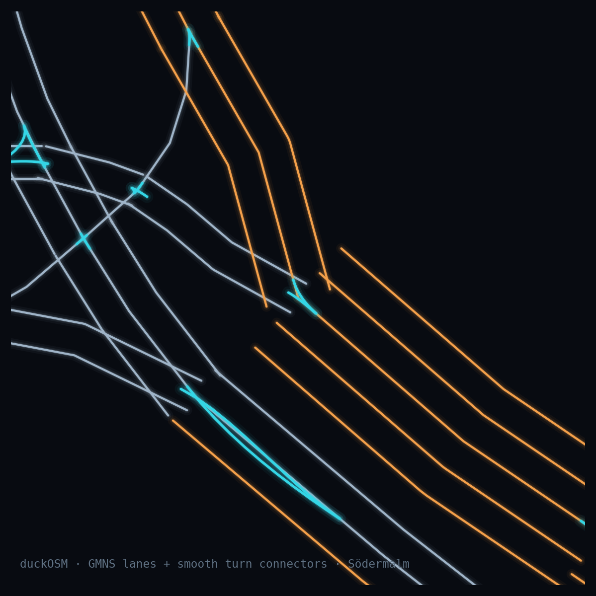
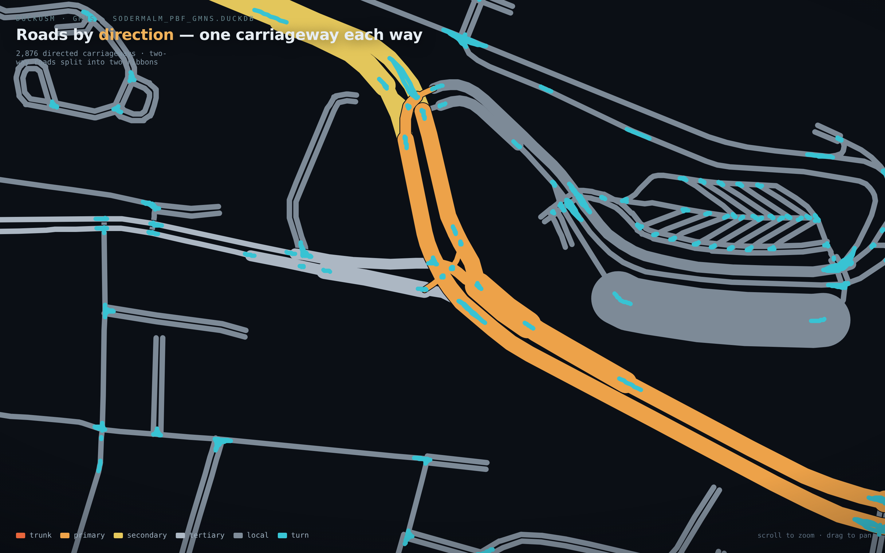

# GMNS

```bash
duckosm gmns monaco.duckdb             # -> monaco_gmns.duckdb
duckosm gmns monaco.duckdb --to-csv gmns/     # also the spec CSVs
```

[GMNS](https://zephyr-data-specs.github.io/GMNS/) (General Modeling Network Specification) is the
open table format of DTALite, Path4GMNS and other network-modelling tools. duckOSM writes every
GMNS table that OSM has data for into **one new DuckDB file** that stands alone: it doesn't need
the source database, and its tables carry real geometry, so you can query and draw them.
`--to-csv` also writes the standard `node.csv`, `link.csv`, `lane.csv`, … for each mode.



## What's in it

One schema per mode, `gmns_driving`, `gmns_walking`, `gmns_cycling`. Monaco, driving:

| Table | Rows | What |
|---|---|---|
| `node` | 1,719 | junctions; `ctrl_type = 'signal'` at traffic lights |
| `link` | 2,765 | directed roads: **`link_id` = `edge_id`**, length, speed, lanes, capacity, `facility_type` (the OSM `highway`), name |
| `lane` | 3,182 | one row per lane, with its turns, allowed uses and width where OSM tags them |
| `movement` | 3,488 | legal turns (from `edge_graph`; turning back along the same road only at a dead end): type (left, thru, right, uturn), code (`NBL`, `EBT`, …), the lanes that feed it, a curved turn path |
| `geometry` | 2,765 | link shapes |
| `signal_controller` | 1 | where the traffic lights are (OSM has no timings) |
| `curb_seg` | 0 | on-street parking, where OSM tags `parking:*` |
| `config`, `use_definition`, `use_group` | | units (metres, km/h), CRS (EPSG:4326), modes |

Tables GMNS defines but OSM has no data for (signal timing, zones, time-of-day) are left out, as
the spec intends.

## Lanes from OSM tags

Every link gets its lanes from its lane count; where OSM has the details, they're filled in:

| OSM tag | Gives |
|---|---|
| `lanes`, `lanes:forward`, `lanes:backward` | the number of lanes each way |
| `turn:lanes` | each lane's turns, and which lanes feed each movement |
| `width:lanes` | lane width (else 3.25 m) |
| `bicycle:lanes`, `psv:lanes`, `busway` | bus and bike lanes |
| `change:lanes` | where lane changes are not allowed |

Most ways have none of these (`turn:lanes` is on 1–2 % of ways), so most lanes are general lanes
3.25 m wide. Lane details need the raw OSM tags, which a PBF build keeps. Each lane also has a
centre line drawn beside the road, on the traffic side (`--drive-side left` for left-hand traffic).

## Meso and micro networks

For simulators that work below the road level:

```bash
duckosm gmns monaco.duckdb --meso --micro
```

- **Meso** (`meso_driving`): each road becomes a section, and each legal turn a connector
  between sections. Monaco: 2,765 sections + 3,488 connectors.
- **Micro** (`micro_driving`): each lane cut into 7 m cells, with lane-change links between side-by-side
  cells and turn links across junctions. Monaco: 27,131 links.

Both follow osm2gmns' layout. Their ids are built from `edge_id` (`M<edge_id>` for a section,
`X<from>-<to>` for a connector), so they stay the same across rebuilds and lead back to the road.
Driving by default; `--meso-mode cycling` / `--micro-mode cycling` for cycling.

## All modes in one network

`--combined` adds `gmns_all`: one `link` table for every mode, a road shared by several modes
being one link with `allowed_uses = 'auto,bike,walk'`. Monaco: 12,969 links.

## See it

```bash
duckosm gmns-viz monaco_gmns.duckdb                 # inspect: lanes / meso / micro layers, hover for ids
duckosm gmns-map monaco_gmns.duckdb                 # present: one ribbon per direction, by road class
duckosm gmns-map monaco_gmns.duckdb --style lane    # every lane at its width
```

Each writes one HTML file that opens offline. `-m` picks the mode.



## Options

| Option | Does | Default |
|---|---|---|
| `-m`, `--mode` | modes to export; repeat for several | every mode in the db |
| `-o`, `--out` | output file | `<name>_gmns.duckdb` |
| `--to-csv DIR` | also write the spec CSVs | |
| `--meso`, `--micro` | also build the meso / micro networks | off |
| `--meso-mode`, `--micro-mode` | their modes | `driving` |
| `--combined` | also write `gmns_all` | off |
| `--drive-side` | `right` or `left` traffic | `right` |
| `--no-lane-geometry` | skip the lane centre lines | computed |

```python
from duckosm import to_gmns, to_meso, to_micro
to_gmns("monaco.duckdb", "monaco_gmns.duckdb")
to_meso("monaco_gmns.duckdb")          # on an existing GMNS db
to_micro("monaco_gmns.duckdb", cell_length_m=7.0)
```

## duckOSM and osm2gmns

[osm2gmns](https://github.com/jiawlu/OSM2GMNS) is the established OSM-to-GMNS tool. Run on the same
Södermalm PBF:

| | duckOSM | osm2gmns 0.7 |
|---|---|---|
| Ids | `edge_id`, the same on every rebuild | numbered from 0 on each run |
| Lanes | per-lane turns, bus and bike lanes, widths from OSM tags | lane geometry |
| Turns | from the graph of legal turns (OSM turn restrictions kept) | from geometry |
| Complex junctions | kept as in OSM | merged into one |
| Modes | all in one file, sharing ids | one network type per run |

osm2gmns goes further for simulation (junction consolidation, a mature micro network); duckOSM's
network keeps stable ids and more of OSM's lane data. They work well together.
