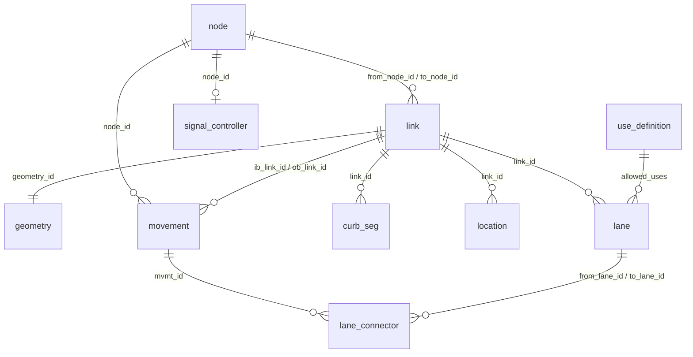

# GMNS tables, one by one

A reference for every table in the GMNS database that `duckosm gmns` writes: what a row is, how it is
made from OSM, and what each column holds. For the command and the options, see [GMNS](gmns.md). For
the standard itself, see the [GMNS specification](https://zephyr-data-specs.github.io/GMNS/spec/)
(release 0.97). Numbers are from Monaco, driving.

## How to read this page

**Where the tables are.** One schema per mode: `gmns_driving`, `gmns_walking`, `gmns_cycling`. With
`--combined` there is also `gmns_all`; with `--meso` / `--micro`, `meso_<mode>` and `micro_<mode>`.

```sql
SELECT count(*) FROM gmns_driving.link;      -- ATTACH the file, or open it directly
```

**Column marks.** The *Spec* column says where a column comes from:

| Mark | Meaning | In the CSVs (`--to-csv`)? |
|---|---|---|
| ✅ | a column of the GMNS standard, filled from OSM | yes |
| ∅ | a column of the standard that OSM has no data for, so it stays empty | yes, empty |
| ➕ | a duckOSM extension: not in the standard | no (the CSV has only standard columns) |

**Conventions that hold in every table:**

- **Ids are integers.** `link_id` is duckOSM's `edge_id`, a content hash (`BIGINT`, up to 19 digits). It is the
  same on every rebuild and the same in every mode, so you can join GMNS to your own data on it.
  Keep it `BIGINT`: as a float or a JavaScript number it loses digits. `node_id` is the OSM node id.
- **Units:** lengths and widths in metres, speeds in km/h, coordinates in longitude / latitude
  (EPSG:4326). The `config` table says so.
- **Geometry twice.** Where a table has a shape, the standard column `geometry` holds it as WKT text, and the
  extension column `geom` holds the same shape as a native `GEOMETRY` you can query with the DuckDB `spatial`
  extension (`ST_*`) and draw. Only `geometry` goes to the CSVs.
- **One link per direction.** A two-way road is two links with swapped nodes and reversed geometry; a
  one-way road is one. Every link has `directed = true`.
- **Lane numbers** run from the left in the direction of travel: lane 1 is the leftmost lane, whichever side
  traffic drives. (With right-hand traffic, the default, the leftmost lane is next to the road's centre line;
  with `--drive-side left` the lanes lie left of it and the leftmost is the farthest.) OSM's `turn:lanes`
  and `bicycle:lanes` list lanes in the same order, so entry *n* is lane *n*.

## The tables at a glance

| Table | Standard? | One row is | Rows | Read it for |
|---|---|---|---|---|
| [`config`](#config) | yes | the dataset | 1 | units, CRS, spec version |
| [`use_definition`](#use_definition) | yes | a way of using a lane (auto, bus, …) | 3 | what `allowed_uses` values mean |
| [`use_group`](#use_group) | yes | a named group of uses | 1 | the mode's uses |
| [`node`](#node) | **required** | a junction or end of a link | 1,904 | where links meet |
| [`link`](#link) | **required** | one direction of a road | 3,092 | the routable network |
| [`geometry`](#geometry) | yes | the shape of a link | 3,092 | link shapes, keyed by id |
| [`lane`](#lane) | yes | one lane of a link | 3,520 | lane use, width, turns |
| [`movement`](#movement) | yes | one legal turn at a junction | 3,957 | which link may follow which, from which lanes |
| [`lane_connector`](#lane_connector) | ➕ extension | one lane-to-lane path across a junction | 1,788 | drawing lanes through junctions |
| [`curb_seg`](#curb_seg) | yes | a stretch of kerb with a rule | 2 | on-street parking |
| [`signal_controller`](#signal_controller) | yes | a traffic signal | 1 | where the signals are |
| [`location`](#location) | yes | a point along a link | 1,803 | crossings, signs, parking entrances |
| [`zone`](#zone) | yes | an area | 0 or 1 | the area's outline |
| [`gmns_all`](#gmns_all-all-modes-in-one) | | all modes in one `node` + `link` | | one network for every mode |
| [`meso_*`, `micro_*`](#meso-and-micro-networks) | osm2gmns layout | sections, connectors, cells | | simulators |

How they point at each other:



## config

One row that says how to read the other tables. It is what a tool needs to know first.

| Column | Type | Spec | Value |
|---|---|---|---|
| `dataset_name` | VARCHAR | ✅ | the output file's name plus the mode, e.g. `monaco_gmns_driving` |
| `short_length` | VARCHAR | ✅ | `meter`: lane widths, linear references |
| `long_length` | VARCHAR | ✅ | `meter`: link lengths |
| `speed` | VARCHAR | ✅ | `kmh` |
| `crs` | VARCHAR | ✅ | `EPSG:4326` |
| `geometry_field_format` | VARCHAR | ✅ | `wkt` |
| `currency` | VARCHAR | ∅ | empty (OSM has no toll prices) |
| `version_number` | DOUBLE | ✅ | `0.97`, the GMNS release the output follows |
| `id_type` | VARCHAR | ✅ | `integer` |

## use_definition

What each use in `allowed_uses` means, so a tool can tell a bus lane from a car lane.

| Column | Type | Spec | Holds |
|---|---|---|---|
| `use` | VARCHAR | ✅ | the name: `auto`, `bus`, `bike` (driving); `walk` (walking); `bike` (cycling) |
| `persons_per_vehicle` | DECIMAL | ✅ | `auto` 1, `bus` 25, `bike` 1, `walk` 1 |
| `pce` | DECIMAL | ✅ | passenger-car equivalents: `auto` 1.0, `bus` 2.0, `bike` 0.2, `walk` 0 |
| `special_conditions`, `description` | VARCHAR | ∅ | empty |

Every use that appears in `link.allowed_uses`, `lane.allowed_uses` or `movement.allowed_uses` is defined here,
as the standard requires.

## use_group

A name for the uses of a mode, to keep `allowed_uses` lists short.

| Column | Type | Spec | Holds |
|---|---|---|---|
| `use_group` | VARCHAR | ✅ | the mode: `driving`, `walking`, `cycling` |
| `uses` | VARCHAR | ✅ | its use: `auto`, `walk`, `bike` |
| `description` | VARCHAR | ∅ | empty |

## node

A point where links start or end: a junction, a dead end, or a point where a road was cut. This is one of
the two required tables, with `link`.

A node is made wherever two OSM ways meet or a way ends (as in the source network's `nodes`). A road that
loops back on itself is cut in two at its midpoint; that point is a node with a **negative** id, because
it is not an OSM node.

| Column | Type | Spec | Holds |
|---|---|---|---|
| `node_id` | BIGINT | ✅ key | the OSM node id; negative for the cut points above |
| `x_coord`, `y_coord` | DOUBLE | ✅ | longitude, latitude |
| `ctrl_type` | VARCHAR | ✅ | `signal` where the OSM node is a `highway=traffic_signals`; empty elsewhere. (Stop and give-way signs are in [`location`](#location).) |
| `name`, `z_coord`, `node_type`, `zone_id`, `parent_node_id` | | ∅ | empty |
| `geom` | GEOMETRY | ➕ | the point |

## link

The routable network: **one row per direction of a road**. A footpath is one link too (two, if it can be
walked both ways).

| Column | Type | Spec | Holds |
|---|---|---|---|
| `link_id` | BIGINT | ✅ key | the `edge_id`: a hash of the OSM way and the two nodes; stable, same in every mode |
| `name` | VARCHAR | ✅ | the street name (`name` tag), often empty |
| `from_node_id`, `to_node_id` | BIGINT | ✅ | the two [`node`](#node)s, in the direction of travel |
| `directed` | BOOLEAN | ✅ | always `true` |
| `geometry_id` | BIGINT | ✅ | the same as `link_id`: the row of [`geometry`](#geometry) |
| `geometry` | VARCHAR | ✅ | the shape, WKT `LINESTRING`, from `from_node` to `to_node` |
| `dir_flag` | INTEGER | ✅ | always `1`: the shape runs from `from_node` to `to_node` |
| `length` | DOUBLE | ✅ | metres: the length of the shape on the ellipsoid, so it always agrees with `geometry` |
| `facility_type` | VARCHAR | ✅ | the OSM `highway` value as it is: `residential`, `primary_link`, `footway`, … |
| `capacity` | DOUBLE | ✅ | saturation capacity, passenger cars per hour **per lane**: a default per road class (motorway 2000, trunk 1800, primary 1600, secondary 1400, tertiary 1200, unclassified 1000, residential 800, living_street 300, service 300, anything else 800). Empty on links that cars cannot use, see below |
| `free_speed` | FLOAT | ✅ | km/h: the `maxspeed` tag, else a default per road class; walking 5, cycling 15 |
| `lanes` | INTEGER | ✅ | the number of permanent **motor-vehicle** lanes in this direction, from the `lanes` / `lanes:forward` / `lanes:backward` tags, **1 where untagged**. Not the number of rows in `lane`: the standard excludes turn pockets, bike lanes, shoulders and parking lanes. Empty on links that cars cannot use |
| `bike_facility` | VARCHAR | ✅ | from OSM `cycleway`, in the standard's words: `unseparated bike lane`, `separated bike lane`, `shared lane`, `counter-flow bike lane`, `paved shoulder`, `none`, `other` |
| `ped_facility` | VARCHAR | ✅ | from OSM `sidewalk`: `sidewalk` (either side or both: which side is lost), `offstreet_path` (`separate`), `none`, `unknown` |
| `allowed_uses` | VARCHAR | ✅ | the mode's use: `auto`, `walk` or `bike` |
| `parking`, `grade`, `toll`, `jurisdiction`, `row_width`, `parent_link_id` | | ∅ | empty (parking is in [`curb_seg`](#curb_seg)) |
| `osm_id` | BIGINT | ➕ | the OSM way the link comes from: one way gives several links (one per piece and direction) |
| `bridge`, `tunnel`, `layer` | VARCHAR | ➕ | the OSM tags as they are (`yes`, `-1`, …): which links are on a bridge or in a tunnel, and the drawing order |
| `geom` | GEOMETRY | ➕ | the shape |

**Links that cars cannot use.** In the walking and cycling schemas, a link whose OSM `highway` is
`footway`, `path`, `cycleway`, `steps`, `pedestrian`, `bridleway`, `corridor` or `platform` has `lanes` and
`capacity` empty: both are motor-vehicle quantities, and the standard treats foot and bike links as
uncapacitated. A road that is walked or cycled on keeps its motor `lanes` and `capacity`.

```sql
-- the longest bridges
SELECT name, round(length) AS metres FROM gmns_driving.link WHERE bridge = 'yes' ORDER BY length DESC LIMIT 5;
```

## geometry

The shape of every link, in its own table keyed by `geometry_id`: for tools that keep shapes apart from
links. It repeats `link.geometry`, row for row.

| Column | Type | Spec | Holds |
|---|---|---|---|
| `geometry_id` | BIGINT | ✅ key | the `link_id` |
| `geometry` | VARCHAR | ✅ | WKT `LINESTRING` |
| `geom` | GEOMETRY | ➕ | the same, native |

## lane

One row per lane of a link. Without OSM lane tags the lanes are just numbered; with them, each lane knows
its use, width and turns.

| Column | Type | Spec | Holds |
|---|---|---|---|
| `lane_id` | VARCHAR | ✅ key | `<link_id>_<lane_num>`, e.g. `8511077704723192952_2` |
| `link_id` | BIGINT | ✅ | the [`link`](#link) |
| `lane_num` | BIGINT | ✅ | 1 = the leftmost lane in the direction of travel, up to the number of lanes |
| `allowed_uses` | VARCHAR | ✅ | `auto`; `bus` where `psv:lanes` / `bus:lanes` says `designated`; `bike` where `bicycle:lanes` does (driving). `walk` / `bike` in the walking / cycling schemas |
| `width` | DOUBLE | ✅ | metres, from `width:lanes`; **empty where untagged** (most lanes: drawing assumes 3.25 m) |
| `r_barrier`, `l_barrier` | VARCHAR | ∅ | empty |
| `turn` | VARCHAR | ➕ | the lane's `turn:lanes` value (`left`, `through;right`, …), empty where untagged |
| `geom` | GEOMETRY | ➕ | the lane's centre line, offset from the link line by the widths of the lanes before it. A two-way road's lanes sit on the traffic side; a road mapped as two one-way ways is placed as one road (no overlap) |

How many rows: the lane count, plus a lane for each extra entry of `turn:lanes` (a turn pocket). That is
why a link can have `lanes = 2` and three `lane` rows.

```sql
-- the lanes of one street, with their uses
SELECT l.name, k.link_id, k.lane_num, k.allowed_uses
FROM gmns_driving.link l JOIN gmns_driving.lane k USING (link_id)
WHERE l.name = 'Boulevard Charles III' ORDER BY k.link_id, k.lane_num;
```

## movement

One row per legal turn: **from this link, onto that link, at this node**. It says which links may follow
which, and from which lanes.

The turns are the legal ones: OSM turn restrictions are applied. Turning back onto the road's other
direction (a U-turn) is kept only at a dead end, or where it is the only way into that road's other
direction.

| Column | Type | Spec | Holds |
|---|---|---|---|
| `mvmt_id` | VARCHAR | ✅ key | `<ib_link_id>-<ob_link_id>` |
| `node_id` | BIGINT | ✅ | the junction where the turn is made: the end of the inbound link and the start of the outbound |
| `ib_link_id`, `ob_link_id` | BIGINT | ✅ | the inbound and outbound [`link`](#link) |
| `type` | VARCHAR | ✅ | `left`, `right`, `thru`, `uturn` (from the change of heading at the junction), `merge`, `diverge` (the road joins or splits within 45°) |
| `mvmt_code` | VARCHAR | ✅ | direction of travel and turn, e.g. `NBL` = northbound, left (`NB`/`EB`/`SB`/`WB` + `L`/`T`/`R`). **Empty for a U-turn**: the standard's code has no U; `type` says it |
| `start_ib_lane`, `end_ib_lane` | INTEGER | ✅ | the inbound lanes the turn starts from, `lane_num` from..to |
| `start_ob_lane`, `end_ob_lane` | INTEGER | ✅ | the outbound lanes it ends in. The two ranges are the same length and match in order: the first inbound lane goes to the first outbound lane |
| `allowed_uses` | VARCHAR | ✅ | the mode's use |
| `ctrl_type` | VARCHAR | ✅ | `signal` at a signalised junction |
| `geometry` | VARCHAR | ✅ | a short curve from the end of the inbound link to the start of the outbound link, WKT |
| `name`, `penalty`, `capacity` | | ∅ | empty |

Where the lane ranges come from: the OSM `turn:lanes` tag where there is one, otherwise osm2gmns' rule
(the leftmost link takes the leftmost lanes, the rightmost link the rightmost; a road that goes on keeps
its lanes). A range is never half empty: both ends are set, or none.

```sql
-- from which lanes can a vehicle turn left?
SELECT i.name, k.lane_num
FROM gmns_driving.movement m
JOIN gmns_driving.link i ON i.link_id = m.ib_link_id
JOIN gmns_driving.lane k ON k.link_id = m.ib_link_id
                        AND k.lane_num BETWEEN m.start_ib_lane AND m.end_ib_lane
WHERE m.type = 'left';
```

## lane_connector

duckOSM's own table, for drawing and for lane-level routing: the **path from one lane to the next** across
a junction. A movement from lanes 1-2 into lanes 1-2 has two connectors.

| Column | Type | Holds |
|---|---|---|
| `connector_id` | VARCHAR | `<from_lane_id>><to_lane_id>` |
| `mvmt_id` | VARCHAR | the [`movement`](#movement) it belongs to |
| `from_lane_id`, `to_lane_id` | VARCHAR | the two [`lane`](#lane)s |
| `width` | DOUBLE | metres (the lane width, 3.25 m by default) |
| `geom` | GEOMETRY | a curve from the end of the first lane to the start of the second |

Lanes stop where a junction starts, or where they would jump sideways; the connector joins them. Not in
the standard, so never in the CSVs. See the [design](https://github.com/Khoshkhah/duckOSM/blob/main/docs/design/gmns_lane_connectors.md).

## curb_seg

A stretch of kerb with a rule. duckOSM writes on-street parking, where OSM tags `parking:left` /
`parking:right` (or `parking:lane:<side>`). Monaco has two.

| Column | Type | Spec | Holds |
|---|---|---|---|
| `curb_seg_id` | VARCHAR | ✅ key | `<link_id>_<side>` |
| `link_id` | BIGINT | ✅ | the [`link`](#link) |
| `ref_node_id` | BIGINT | ✅ | the link's `from_node_id`: where distance 0 is |
| `start_lr`, `end_lr` | DOUBLE | ✅ | metres from `ref_node_id`: the whole link, `0` to its length |
| `regulation` | VARCHAR | ✅ | the OSM tag value, e.g. `parallel` |
| `width` | INTEGER | ✅ | empty |

## signal_controller

Where traffic signals are. OSM has no signal timing, so there are no phases or plans: only the
controllers.

| Column | Type | Spec | Holds |
|---|---|---|---|
| `controller_id` | VARCHAR | ✅ key | `sig_<node_id>` |
| `node_id` | BIGINT | ➕ | the signalised [`node`](#node) |
| `control_type` | VARCHAR | ➕ | `signal` |

## location

A point **along a link**: a crossing, a stop or give-way sign, a signal. It is how the standard places
street furniture, and OSM has many of these (Monaco, driving: 1,521 crossings, 108 parking entrances,
100 give-way signs, 34 signals, 20 stop signs).

A row is made for each OSM node that lies on a link (within about 0.2 m of its shape) and carries one of these
tags: `highway` = `crossing`, `bus_stop`, `give_way`, `stop`, `traffic_signals`, `toll_gantry`,
`mini_roundabout`, `speed_camera`; `traffic_calming`; `amenity=parking_entrance`; `railway=level_crossing`.
A node that lies on several links (a junction) gets a row for each. A node beside the road, on no link, is
not written: that is why Monaco has no bus stops here, its stops are platform nodes next to the road. The
table needs the raw OSM tags, like lane details do: an area clipped from a bigger build has none.

| Column | Type | Spec | Holds |
|---|---|---|---|
| `loc_id` | VARCHAR | ✅ key | `<osm_id>_<link_id>` |
| `link_id` | BIGINT | ✅ | the [`link`](#link) it lies on |
| `ref_node_id` | BIGINT | ✅ | the link's `from_node_id` |
| `lr` | DOUBLE | ✅ | metres from `ref_node_id` along the link's shape |
| `x_coord`, `y_coord` | DOUBLE | ✅ | longitude, latitude of the OSM node |
| `loc_type` | VARCHAR | ✅ | the OSM tag value: `crossing`, `bus_stop`, `give_way`, … (the standard recommends OSM names) |
| `z_coord`, `zone_id`, `gtfs_stop_id` | | ∅ | empty (no GTFS in the data) |
| `osm_id` | BIGINT | ➕ | the OSM node id |
| `geom` | GEOMETRY | ➕ | the point |

## zone

An area, as a polygon. duckOSM writes **one** zone: the outline of the area you built, when the
database was built with a boundary (`--boundary`, an H3 cell, an admin area; Tartu has one, Monaco does not).
Without one, there is no `zone` table. [lanestyle](https://github.com/Khoshkhah/lanestyle) draws this outline.

| Column | Type | Spec | Holds |
|---|---|---|---|
| `zone_id` | VARCHAR | ✅ key | `1` |
| `name` | VARCHAR | ✅ | the boundary's name, if it has one |
| `boundary` | VARCHAR | ✅ | the outline as WKT `POLYGON` / `MULTIPOLYGON` |
| `super_zone` | VARCHAR | ∅ | empty |
| `geom` | GEOMETRY | ➕ | the same outline, native |

## gmns_all: all modes in one

`--combined` adds a schema `gmns_all` with `config`, `node`, `link`, `use_definition` and `use_group`
only. A road used by several modes is **one link** (they share `link_id`), with `allowed_uses` listing
them all, e.g. `auto,bike,walk`. There are no lanes or movements here: they differ by mode, so they stay in
the per-mode schemas.

## Meso and micro networks

`--meso` and `--micro` build networks for simulators, in osm2gmns' layout (not the standard's; the
standard has no meso or micro tables). Their ids are built from the `link_id`, so they lead back to the
road.

| Schema.table | Rows | One row is | Main columns |
|---|---|---|---|
| `meso_<mode>.meso_node` | 5,752 | a section end | `node_id`, `x_coord`, `y_coord`, `macro_node_id`, `macro_link_id`, `geom` |
| `meso_<mode>.meso_link` | 7,379 | a road **section** (`meso_type = 'normal'`) or a turn **connector** (`'movement'`) | `link_id`, `from_node_id`, `to_node_id`, `length`, `lanes`, `capacity`, `free_speed`, `macro_link_id`, `movement_id`, `mvmt_txt_id`, `start_ib_lane`, `end_ib_lane`, `geometry`, `geom` |
| `micro_<mode>.micro_node` | 54,730 | the start of a 7 m **cell** of a lane | `node_id` (`<lane_id>@<k>`), `x_coord`, `y_coord`, `lane_id`, `cell_k`, `geom` |
| `micro_<mode>.micro_link` | 70,535 | a cell, a lane change between side-by-side cells, or a turn across a junction (`cell_type`) | `link_id`, `from_node_id`, `to_node_id`, `length`, `width`, `lane_no`, `macro_link_id`, `meso_link_id`, `geometry`, `geom` |

(Södermalm, driving.)

## What is not written, and why

The standard has 25 tables. duckOSM writes 12 of them (everything above except `lane_connector`, which is
its own) and leaves out the other 13:

| Tables | Why |
|---|---|
| `segment`, `segment_lane` (a lane added or dropped part-way along a link) | not needed: an edge is cut at every node that two ways share or where a way ends, so wherever OSM's `lanes` changes, the edge is already cut |
| `link_tod`, `lane_tod`, `movement_tod`, `segment_tod`, `segment_lane_tod`, `time_set_definitions` (time-of-day changes) | OSM's `*:conditional` tags are on a fraction of one percent to 7 % of ways, and are mostly parking and loading rules, not travel lanes |
| `signal_timing_plan`, `signal_timing_phase`, `signal_phase_mvmt`, `signal_coordination`, `signal_detector` | OSM has no signal timing, phases or detectors; any value would be invented |

## Checking the output

The CSVs are validated against the standard's own schemas on every test run, and `duckosm gmns --check`
tests that the values agree with each other (a link starts and ends on its nodes, `length` is its shape's,
lane numbers run 1..n, a movement turns where its inbound link ends and uses lanes that exist). See
[Conformance](gmns.md#conformance-to-the-gmns-standard).
