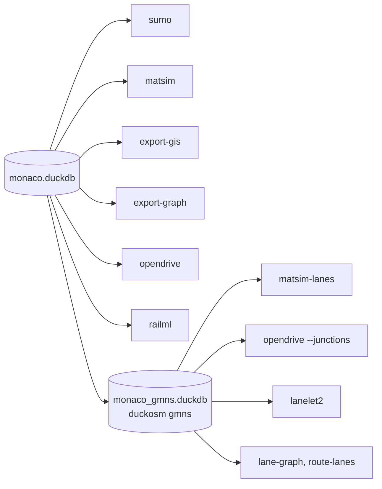

# Exports

Every export reads a built database and keeps the **`edge_id` as the id in the target format**
(SUMO edge id, MATSim link id, GMNS `link_id`, OpenDRIVE road id, a GIS attribute). So anything
you keyed on an `edge_id` in duckOSM (counts, speeds, sensor data) joins straight onto the
exported network.

## Which export for which tool

| You use | Export | Command |
|---|---|---|
| SUMO | [SUMO](sumo.md) `.net.xml` | `duckosm sumo` |
| MATSim, BEAM, eqasim | [MATSim](matsim.md) `network.xml`, plus lanes and signals | `duckosm matsim`, `matsim-lanes` |
| DTALite, Path4GMNS, other GMNS tools | [GMNS](gmns.md) tables (DuckDB or CSV), plus meso / micro networks | `duckosm gmns` |
| QGIS, ArcGIS, FME, Visum, Aimsun importers | [GeoPackage or shapefile](gis.md) | `duckosm export-gis` |
| Python analysis | [networkx](networkx.md) graph, GraphML, gpickle | `duckosm export-graph` |
| CARLA, esmini, Vissim | [OpenDRIVE](opendrive.md) `.xodr` (experimental) | `duckosm opendrive` |
| Autoware, the lanelet2 library | [Lanelet2](lanelet2.md) `.osm` (experimental) | `duckosm lanelet2` |
| OpenTrack, RailSys, Viriato | [railML 2.4](railml.md) (experimental) | `duckosm railml` |

**Experimental** exports work and are tested for structure, but haven't been loaded in the target
tools yet. If you try one, an issue saying how it went helps.

## Two starting points

Most exports read the database `duckosm build` writes. The lane-level ones need the lanes and turns
per lane first, so they read a **GMNS database** made by `duckosm gmns`:

## Coordinates

Most exports write longitude / latitude (EPSG:4326). MATSim and OpenDRIVE need metres, so they
reproject to the **UTM zone of the data** (EPSG:32632 for Monaco); `--crs` picks another, e.g.
`EPSG:3006` for Sweden's national grid.

## Elevation

After [`duckosm elevation`](../guides/elevation.md), the heights go along: GIS layers get `ele` /
`z_from` / `z_to` attributes, MATSim nodes a `z`, and OpenDRIVE roads an elevation profile.
