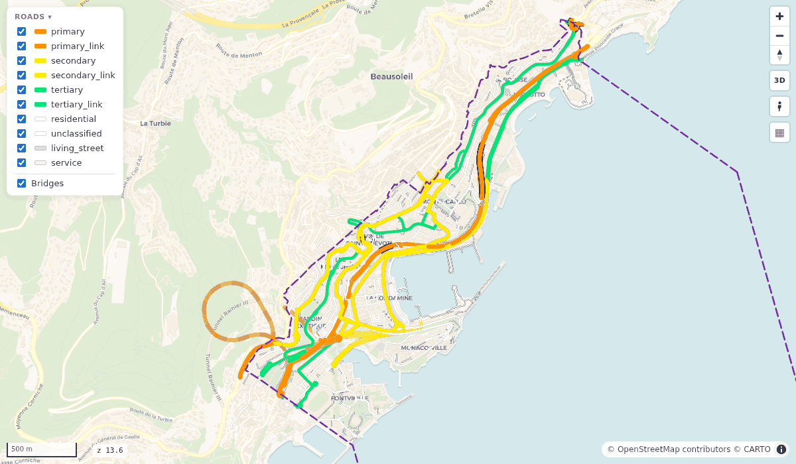

# Your first network

This builds the road network of Monaco from scratch, then queries it, routes on it and draws it.
It takes a few minutes. You need duckOSM [installed](install.md) with `pip install "duckosm[routing,viz]"`.

## 1. Choose your area

Search for **Monaco** on [openstreetmap.org](https://www.openstreetmap.org) and click the result whose
border is drawn on the map. The page address ends in
[`relation/1124039`](https://www.openstreetmap.org/relation/1124039): **1124039** is Monaco's OSM id.

## 2. Download the map data

OpenStreetMap data comes as `.osm.pbf` files. [Geofabrik](https://download.geofabrik.de) offers free
extracts of every continent, country and many regions, updated daily. Monaco has its own:

```bash
curl -LO https://download.geofabrik.de/europe/monaco-latest.osm.pbf       # 0.7 MB
```

For your own area, download the smallest region that contains it.

## 3. Make the boundary file

```bash
duckosm boundary --osm-id 1124039 --pbf monaco-latest.osm.pbf
```

```text
wrote monaco.geojson: Monaco (admin level 2, OSM relation 1124039, 79.8 km²), from PBF monaco-latest.osm.pbf
```

## 4. Build the network

```bash
duckosm build --pbf monaco-latest.osm.pbf -b monaco.geojson \
    -m driving -m walking -m cycling
```

About ten seconds later you have **`monaco.duckdb`**: one file holding a driving, a walking and a
cycling network, each in its own schema. Roads that cross the border are kept whole, and small pieces
that don't connect to the rest are removed.

## 5. Query it

The database is a normal DuckDB file. Which kinds of road make up Monaco's driving network?

```python
import duckdb

con = duckdb.connect("monaco.duckdb", read_only=True)
con.sql("""SELECT highway, count(*) AS edges, round(sum(length_m) / 1000, 1) AS km
           FROM driving.edges GROUP BY highway ORDER BY km DESC LIMIT 5""").show()
```

```text
┌─────────────┬───────┬────────┐
│   highway   │ edges │   km   │
│   varchar   │ int64 │ double │
├─────────────┼───────┼────────┤
│ residential │   610 │   32.8 │
│ service     │   701 │   28.4 │
│ secondary   │   339 │   14.9 │
│ tertiary    │   254 │   12.5 │
│ primary     │   184 │   11.2 │
└─────────────┴───────┴────────┘
```

## 6. Find a route

Routes go from one edge (a directed piece of road) to another, and only take legal turns:

```python
from duckosm import route

q = "SELECT min(edge_id) FROM driving.edges WHERE name = ?"
a = con.execute(q, ["Boulevard du Larvotto"]).fetchone()[0]
b = con.execute(q, ["Avenue Princesse Grace"]).fetchone()[0]

r = route(con, a, b)
r["time_s"], r["length_m"]          # (130.0, 1734.3): about 2 minutes, 1.7 km
r["edges"]                          # the 25 edge_ids along the way
```

Every `edge_id` stays the same when you rebuild, cut out a smaller area, or export: see
[Stable edge ids](architecture.md#stable-edge-ids).

## 7. Draw it

```bash
duckosm viz monaco.duckdb -m driving       # -> reports/monaco_driving_network.html
```

Open the file in a browser:



## Next

- Build your own area: the same steps, with your area's id and region file.
- [User manual](user_manual.md): every build option, routing across modes, and more.
- [Exports](user_manual.md#exports): SUMO, MATSim, GMNS, GIS and more.
