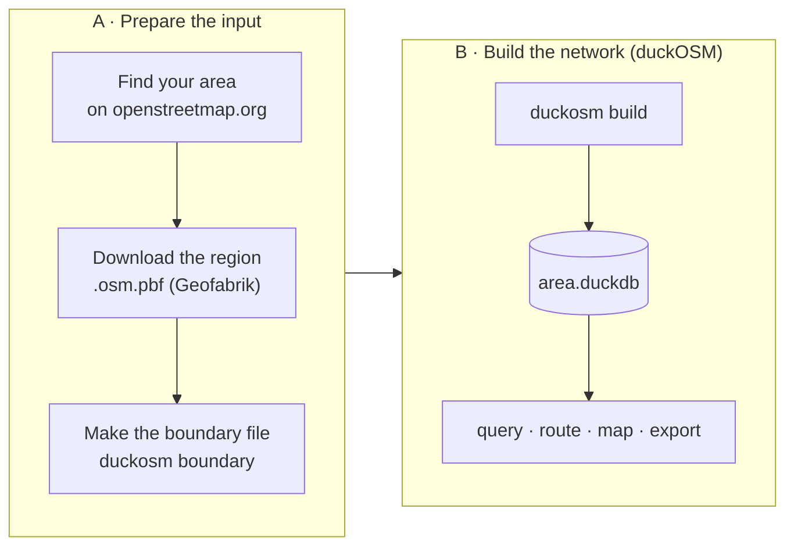

# duckOSM User Manual

## Installation

```bash
pip install duckosm                      # core
pip install "duckosm[routing]"           # + networkx, for route() / Router / to_networkx
```

Other extras: `[sumo]` (SUMO export), `[elevation]` (DEM sampling), `[viz]`
(`duckosm viz` maps). To work on duckOSM itself, install from source: see [Development](development.md).

Every relative path duckOSM uses (outputs, configs, reports) resolves against the folder you run
`duckosm` in.

## Workflow: from map data to a network

The work has two parts: **preparing the input** (the map data and your area's border), then
**building the network**, which is duckOSM's own job.



### A. Prepare the input

#### A1. Find your area on openstreetmap.org

Search for your city or district on [openstreetmap.org](https://www.openstreetmap.org) and click the
result whose border is drawn on the map. The page address ends in `relation/<id>`: that number is
the area's **OSM id**. Monaco is [relation/1124039](https://www.openstreetmap.org/relation/1124039).
Seeing the outline on the map is the easiest way to be sure it's the right area (there is a Södermalm
in Stockholm and another one in Sundsvall). Skip this step to build a whole region.

#### A2. Download the region's map data

duckOSM reads OpenStreetMap data as an `.osm.pbf` file. The usual source is
[Geofabrik](https://download.geofabrik.de): free extracts of every continent, country and many
regions, updated daily. Pick the **smallest region that contains your area** and download its
`-latest.osm.pbf`:

```bash
curl -LO https://download.geofabrik.de/europe/monaco-latest.osm.pbf     # 0.7 MB
curl -LO https://download.geofabrik.de/europe/sweden-latest.osm.pbf     # 835 MB
```

Any `.osm.pbf` works, up to the [whole planet](https://planet.openstreetmap.org).

#### A3. Make the boundary file

```bash
duckosm boundary --osm-id 1124039 --pbf monaco-latest.osm.pbf     # -> monaco.geojson
```

This reads the area's border from the PBF (offline; needs GDAL's `ogr2ogr`), or from OpenStreetMap
online without `--pbf`. It prints what it wrote:

```text
wrote monaco.geojson: Monaco (admin level 2, OSM relation 1124039, 79.8 km²), from PBF monaco-latest.osm.pbf
```

**Shortcut: search by name.** `duckosm boundary Monaco --pbf monaco-latest.osm.pbf` finds the border by
name instead (case, accents and hyphens don't matter). If the name matches more than one border, it
takes the exact name with the largest area and lists the others with their ids, so you can rerun with
the right `--osm-id`:

```text
also matched (pick one with --osm-id):
  Monaco (admin level 8, OSM relation 2220322, 2.39 km²)
  Monaco-Ville (admin level 10, OSM relation 2220207, 0.2 km²)
```

Any GeoJSON polygon you already have works too.

### B. Build the network

#### B1. Build

```bash
duckosm build --pbf monaco-latest.osm.pbf -b monaco.geojson -m driving -m walking -m cycling
# -> monaco.duckdb
```

With a boundary, the build keeps only what's inside it and removes small disconnected pieces, so every
point of the network can reach every other. (It first cuts the PBF to the boundary and keeps that copy in
`./pbf/` for the next build.) For repeatable builds, put the same settings in a config
file: `duckosm init-config monaco.yaml`, edit it, then `duckosm build -c monaco.yaml` (see
[Build options](#build-options)).

#### B2. Use it

The result is one DuckDB file: [query it](#example-queries) with SQL, [route](#routing) on it,
[draw a map](#visualization), or [export it](#exports) to SUMO, MATSim, GMNS or GIS.

#### Several areas from one region

Build the big region once, then cut areas out of it in seconds. No OSM is re-read, and every
`edge_id` is the parent's, so data keyed on the parent's ids works on the area as-is:

```bash
duckosm build --pbf sweden-latest.osm.pbf -m driving        # slow, once -> sweden-latest.duckdb
duckosm boundary --osm-id 2017432 -o sodermalm.geojson      # Södermalm, Stockholm
duckosm extract --source sweden-latest.duckdb --db sodermalm.duckdb --boundary sodermalm.geojson
```

`extract` also takes `--name` / `--osm-id` when the parent has [admin boundaries](admin_boundaries.md).
Edges that cross the border are kept whole.

To get just a smaller PBF of the area, e.g. for another tool:
`duckosm clip-pbf sweden-latest.osm.pbf sodermalm.geojson` (→ `sodermalm.osm.pbf`).

## Build options

With no `--config` and no `--pbf` / `--source-db`, `build` loads `config/default.yaml` if it exists.

### CLI options (`duckosm build`)

| Option | Description | Default |
|--------|-------------|---------|
| `-c`, `--config` | YAML config file | none |
| `-p`, `--pbf` | Input `.osm.pbf` (or give a config / `--source-db`) | none |
| `-o`, `--output` | Output DuckDB file | `<boundary name>.duckdb` if a boundary is given, else `<pbf name>.duckdb`, in the current folder |
| `-b`, `--boundary` | GeoJSON boundary to clip to | none |
| `--source-db` | Parent duckOSM db to clip from (instead of a PBF) | none |
| `-m`, `--modes` | `driving`, `walking` or `cycling`; repeat for several (`-m driving -m walking`) | `driving` |
| `--graph` / `--no-graph` | Build the `edge_graph` table | on |
| `--h3-index` / `--no-h3-index` | Add H3 cells to nodes and edges | on |
| `--h3-resolution` | H3 resolution (0-15) | `8` |
| `--log-file` | Also write the log to this file | none (console only) |

### Configuration file

`duckosm init-config my_area.yaml` writes the fully commented [template](https://github.com/Khoshkhah/duckOSM/blob/main/src/duckosm/templates/config.yaml); every field is
described in [Configuration](configuration.md). In a clone of the repo, `config/sample_monaco.yaml`
builds the bundled Monaco extract in seconds: `duckosm build --config config/sample_monaco.yaml`.
The core of the template:

```yaml
name: my_area                          # output file: <output_path>/<name>.duckdb
output_path: .                         # a directory, or a full *.duckdb path

source:
  type: pbf                            # 'pbf' (build from OSM) | 'duckdb' (clip a built db)
  pbf_path: data/maps/input.osm.pbf

boundary:                              # optional clip region
  path: null                           # GeoJSON polygon file

modes: [driving, walking, cycling]

options:
  h3_resolution: 8
  simplify: true                       # contract degree-2 nodes and merge same-road chains

validation:
  enabled: true                        # fail the build on a broken invariant
```

## What a build contains

Each mode gets its own schema (`driving`, `walking`, `cycling`) with:

| Table | |
|---|---|
| `edges` | directed road segments: `edge_id`, `source` → `target`, geometry, `length_m`, `maxspeed_kmh`, `cost_s`, `lanes`, `oneway`, `highway`, `name`, … |
| `nodes` | junctions and end points (`node_id < 0` = virtual node) |
| `edge_graph` | legal edge → edge turns (`from_edge`, `to_edge`): the routing graph, built from every edge incl. `highway=service` |
| `turn_restrictions` | OSM turn restrictions (driving only) |

Every id column (`edge_id`, `source`, `target`, `from_edge`, …) is `BIGINT`; keep it `BIGINT` when
you join. H3 columns (`nodes.h3_cell`, `edges.from_cell` / `to_cell` / `lca_res`) exist only when
H3 indexing is on. Every column is described in the [data dictionary](data_dictionary.md).

## Python API

```python
from duckosm import DuckOSM, Config

# From YAML config
config = Config.from_yaml("my_area.yaml")
output_path = DuckOSM(config).run()

# Query results
import duckdb
con = duckdb.connect(str(output_path), read_only=True)
edges = con.sql("SELECT * FROM driving.edges LIMIT 10").fetchall()
```

## Example Queries

```sql
-- Fastest roads
SELECT name, highway, maxspeed_kmh, length_m
FROM driving.edges
ORDER BY maxspeed_kmh DESC LIMIT 10;

-- Edges by road class
SELECT highway, count(*) AS n
FROM driving.edges
GROUP BY highway ORDER BY n DESC;

-- Legal next edges after one edge (the line graph)
SELECT to_edge, cost
FROM driving.edge_graph
WHERE from_edge = 2226047604433257818;    -- Avenue Delphine, from `duckosm way`

-- Edges starting in one H3 cell (needs H3 indexing)
SELECT * FROM driving.edges
WHERE from_cell = 617700169958293503;
```

More in the [query cookbook](query_cookbook.md).

### Look up one OSM way by its `osm_id`

`duckosm way` shows all the data a build has for one OSM **way** (the OpenStreetMap object for a
street, or a stretch of one): first its raw OSM tags and node list, then every edge built from it,
in every mode, as one table.

```bash
duckosm way monaco.duckdb 4230100                   # Avenue Delphine; -m driving for one mode, --geom for WKT
duckosm way monaco.duckdb 4230100 -o way.csv        # write the table to a file (.csv / .parquet / .json)
```

```text
raw way 4230100: 10 node refs
  tags: {'highway': 'residential', 'name': 'Avenue Delphine'}
  refs: [21923931, 12421715488, 21924090, 25243156, 3625098865, ...]
```

| mode | edge_id | edge_ref | source → target | length_m | maxspeed_kmh | cost_s | walk_type / cycle_type |
|---|---|---|---|---|---|---|---|
| cycling | 2226047604433257818 | 4230100#1f | 21923931 → 21924057 | 88.3 | 15 | 21.2 | mixed_traffic |
| driving | 2226047604433257818 | 4230100#1f | 21923931 → 21924057 | 88.3 | 30 | 10.6 | |
| walking | 2226047604433257818 | 4230100#1f | 21923931 → 21924057 | 88.3 | 5 | 63.6 | shared_road |
| cycling | 3664387098764709418 | 4230100#1r | 21924057 → 21923931 | 88.3 | 15 | 21.2 | mixed_traffic |
| driving | 3664387098764709418 | 4230100#1r | 21924057 → 21923931 | 88.3 | 30 | 10.6 | |
| walking | 3664387098764709418 | 4230100#1r | 21924057 → 21923931 | 88.3 | 5 | 63.6 | shared_road |

(A selection of the columns; the real table has every `edges` column.) This two-way street became two
edges, one per direction (`#1f` forward, `#1r` reverse). Each has the same `edge_id` in all three
modes, with that mode's own speed and travel time.

```python
from duckosm.query import way_table
way_table(con, 4230100).show()                      # the same table in Python / a notebook
```

Use it when a particular street looks wrong: how it was split, which edges came from it, what speed
and cost each got. A negative `osm_id` looks up the short connector edges duckOSM adds to join
dangling paths.

## Visualization

```bash
pip install "duckosm[viz]"
duckosm viz monaco.duckdb        # -> reports/monaco_<mode>_network.html, one map per mode
```

Each map shows the roads coloured by class, with a legend, a base-map switcher, a hover tooltip and
a 2D/3D button. Click a road to copy its `edge_id`. Tunnels are drawn under the roads above them,
bridges on top.

| Option | Does |
|---|---|
| `-m driving` | one mode only (default: every mode) |
| `--arrows` | direction arrows on one-way roads (zoom in to see them) |
| `--basemap positron` | first base map: `voyager` (default), `positron`, `dark_matter`, `osm`, `satellite`, `blank` |
| `--no-boundary` | hide the dashed outline of the clip area |
| `--out-dir maps` | output folder (default `reports`) |

**Other palettes, or colour by a column** (needs a clone of the repo):

```bash
python scripts/roadstyle_map.py --db monaco.duckdb --palette mono           # highsat | carto | mono
python scripts/roadstyle_map.py --db monaco.duckdb --color-by maxspeed_kmh
```

## Routing

A route goes from one edge to another over `edge_graph`, so it only takes legal turns. Needs
`pip install "duckosm[routing]"`.

```python
import duckdb
from duckosm import route, Router

con = duckdb.connect("monaco.duckdb", read_only=True)

r = route(con, from_edge, to_edge)                  # fastest, by car
r["edges"], r["time_s"], r["length_m"]              # ordered edge_ids, seconds, metres
r["path"]                                           # per edge: name, highway, length_m, cost_s, geometry

route(con, from_edge, to_edge, weight="length")     # shortest instead of fastest
route(con, from_edge, to_edge, mode="walking")      # on the walking network (or "cycling")

router = Router(con, mode="driving")                # many routes: build the graph once
router.route(from_edge, to_edge)
```

The graph is held in memory: fine for a city, heavy for a country.

### Across modes (walk → drive → walk)

`duckosm multimodal` joins the walking, cycling and driving networks at the junctions they share (a
mode change costs 60 s; `--transfer-cost` changes it). `route_multimodal` then finds the fastest
trip that may change mode on the way. It goes from one junction to another (OSM `node_id`s), starts
and ends on foot, and returns `None` if the two points aren't connected. *Experimental.*

```bash
duckosm multimodal monaco.duckdb             # adds the mm.* tables to the db
```

```python
from duckosm import route_multimodal

r = route_multimodal(con, from_node, to_node)
r["time_s"], r["legs"]                       # e.g. 552 s: walk 7 s -> drive 264 s -> walk 161 s
```

More in [Intermodal routing](multimodal.md).

### As a networkx graph

| Function | Nodes | Edges |
|---|---|---|
| `to_networkx(con)` | edges (`edge_id`), with name, highway, length, speed, geometry | legal turns, weighted by time (`weight="length"`: metres) |
| `to_networkx_nodes(con)` | junctions (`x`, `y` = lon, lat) | roads, keyed by `edge_id`, with every column (osmnx layout) |

Both take `mode=` too.

To save either one to a file (the format comes from the extension):

```bash
duckosm export-graph monaco.duckdb                            # -> monaco_driving.graphml (junctions)
duckosm export-graph monaco.duckdb -g edge -o routing.gpickle # the routing graph
```

GraphML opens in any tool but stores lists and geometry as text; gpickle keeps everything but only
loads in Python. From Python: `write_graph(con, "monaco.graphml")`.

## Exports

Every exporter keeps `edge_id` as the target format's own id.

| Format | Command | Details |
|---|---|---|
| SUMO | `duckosm sumo` | below |
| MATSim | `duckosm matsim`, `matsim-lanes` | [MATSim network](matsim_export.md), [lanes & signals](matsim_lanes_signals.md) |
| GMNS | `duckosm gmns` | [GMNS](gmns_export.md) |
| GeoPackage / shapefile | `duckosm export-gis` | [GeoPackage / shapefile](gis_export.md) |
| networkx | `duckosm export-graph` | above |

### SUMO export

Export the network to a [SUMO](https://eclipse.dev/sumo/) simulation net whose edge ids **are** the
duckOSM `edge_id`. `to_sumo` writes SUMO plain-XML — `.nod.xml`, `.edg.xml` (ids = `edge_id`) and
`.con.xml` (the legal successors from `edge_graph`) — plus a standard netconvert config (`.netccfg`),
then runs **netconvert** to assemble the `.net.xml`. netconvert keeps the ids and the explicit
connections, so per-edge data (flow / demand / a regime table) maps onto the simulation **by
identity** (no geometry conflation) **and turn restrictions are honoured** (movements limited to the
`edge_graph` successors, not guessed). Needs `pip install duckosm[sumo]`.

```python
import duckdb
from duckosm import to_sumo

con = duckdb.connect("monaco.duckdb", read_only=True)
out = to_sumo(con, "sumo/")                  # sumo/network.{nod,edg,con}.xml + .netccfg + .net.xml
out["net"], out["n_edges"], out["n_connections"]

to_sumo(con, "sumo/", run_netconvert=False)            # only the plain-XML (assemble it yourself)
to_sumo(con, "sumo/", config={"junctions.join": "true"})   # override default netconvert options
to_sumo(con, "sumo/", config="my.netccfg")             # or drive it with your own config file
```

Or from the CLI: `duckosm sumo monaco.duckdb` (`--no-netconvert` for plain-XML only,
`--no-connections` to let netconvert infer turns, `-c my.netccfg` for a custom config, `--out-dir` /
`--name`). Edge `shape`, `numLanes`, `speed`, `priority`/`type` and true `length` are carried over;
coordinates are geographic and netconvert projects them. The netconvert options come from a built-in
default (`DEFAULT_NETCFG`), written as a standard `.netccfg`; pass `config=` (a dict merged onto the
default, or a `.netccfg` path) to change them.

## Troubleshooting

| Issue | Solution |
|-------|----------|
| H3 extension not available | Falls back to Python H3 (slower) |
| Empty turn_restrictions | Normal if area has no restrictions |
| Lock error on database | Use `read_only=True` or close other connections |
